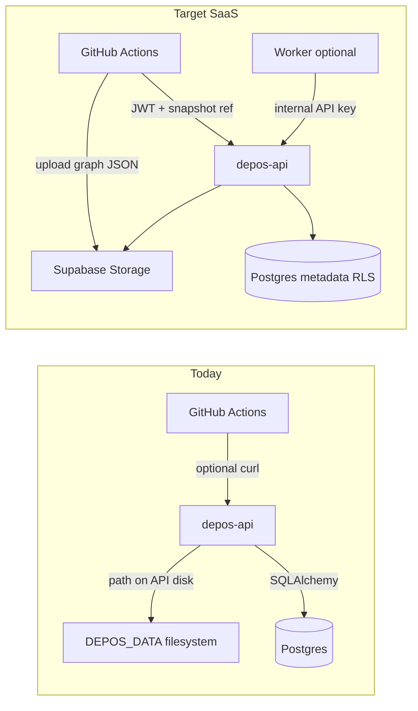

# Backend production readiness (multi-tenant SaaS)

## Current gaps (evidence-based)

- **Tenant routes still assume server-local `root` paths.** [`depos/api_server.py`](depos/api_server.py) `POST /v1/ci/analyze` takes `root: str` and calls `build_graph_for_root(root, ...)`. On a hosted SaaS API, callers cannot meaningfully send the runner’s checkout path; this is the largest functional/security mismatch for your chosen **multi-tenant** model.
- **“Internal” graph routes are unauthenticated** (`/v1/snapshot`, `/v1/federation/preview`, `/v1/drift`) and rely on “network isolation” per the module docstring—insufficient on the public internet ([`depos/api_server.py`](depos/api_server.py) lines 6–7, 150–190).
- **Architecture storage is not implemented.** [`docs/architecture.md`](docs/architecture.md) calls for *graph blobs per commit* plus relational metadata; today graphs are written under [`DEPOS_DATA`](depos/api_server.py) on local disk only (`persist_graph_json`), with **no** `graph_snapshots` (or similar) table in [`supabase/migrations/`](supabase/migrations/).
- **Supabase JS client helpers are unused.** [`depos/supabase_client.py`](depos/supabase_client.py) defines `service_client` / `user_client` but nothing imports them—Storage and any PostgREST-only flows are unwired.
- **Intelligence tables exist but the API does not write them.** Models exist in [`depos/db.py`](depos/db.py) (`IntelligenceRun`, `IntelligenceFinding`) per migration [`20260417120500_init_intelligence_runs.sql`](supabase/migrations/20260417120500_init_intelligence_runs.sql); no FastAPI routes persist runs/findings today.

## Guiding principles

1. **Never trust arbitrary `root` from a tenant JWT** in production. Accept **snapshot references**, **presigned uploads**, or **worker-only** paths behind an **internal credential**.
2. **Graph JSON in Storage; metadata in Postgres** (your choice), aligned with [`docs/architecture.md`](docs/architecture.md) “Graph blobs … metadata … relational store”.
3. **Keep SQLAlchemy for transactional writes** the backend already uses; add **Supabase Storage** via `supabase-py` (`service_client()` from [`depos/supabase_client.py`](depos/supabase_client.py)) for blobs—no need to duplicate RLS semantics on the Storage path if objects are **not public** and access is **server-mediated** (signed URLs or server-side download).

---

## Phase 1 — Security and route classification

| Action | Detail |
|--------|--------|
| Classify routes | **Public**: `GET /health`, `GET /ready` (new). **Tenant JWT**: org/repo/CI correlation/analyze (new shape). **Internal**: snapshot/build/federation/drift **only** with `Authorization: Bearer <DEPOS_INTERNAL_API_KEY>` (or `X-DepOS-Internal-Key` header—pick one and document). |
| Enforce internal auth | Gate `/v1/snapshot`, `/v1/federation/preview`, `/v1/drift` behind the internal key **or** move them to a separate ASGI mount (`/internal/...`) disabled when env unset in production. |
| CORS | Replace default `*` in production when `DEPOS_CORS_ORIGINS` unset—fail fast or require explicit origins for multi-tenant. |
| Rate limiting | Optional: `slowapi` or reverse-proxy (document if deferred). |

**Repo touchpoints:** [`depos/api_server.py`](depos/api_server.py), new small module e.g. `depos/internal_auth.py`, [`.env.example`](.env.example).

---

## Phase 2 — Graph persistence (Storage + Postgres)

| Action | Detail |
|--------|--------|
| New migration | Table e.g. `graph_snapshots`: `id`, `org_id` (FK), `repo_slug`, `git_sha`, `storage_path` (text), `byte_size`, `content_sha256`, `created_by` (user uuid nullable), `created_at`, optional `sarif_summary` jsonb pointer. Indexes on `(org_id, repo_slug, git_sha desc)`. RLS: `is_org_member(org_id)` select; `service_role` all (matches existing pattern in [`ci_signals`](supabase/migrations/20260417120400_init_ci_signals.sql)). |
| Storage layout | Bucket env e.g. `DEPOS_GRAPH_BUCKET=graph-snapshots`. Object key pattern: `{org_id}/{repo_slug}/{git_sha}/{content_sha256}.json` (dedupe-friendly). |
| Upload flow (tenant) | **Option A (recommended for CI):** `POST /v1/graph-snapshots:prepare` returns **signed upload URL** + `snapshot_id` (pending row). Client `PUT`s JSON to Storage, then `POST /v1/graph-snapshots/{id}:complete` verifies size/hash and marks ready. **Option B:** Multipart upload to API, API streams to Storage (simpler client, more API load). |
| Download / analyze | `ci_analyze` loads graph from Storage by `snapshot_id` (member must belong to org owning snapshot) instead of `build_graph_for_root` for tenant path; keep **internal** route that builds from `root` for workers only. |
| Federation / drift | Accept **snapshot ids** or signed URLs in addition to raw paths for parity; internal path remains for trusted workers. |

**Repo touchpoints:** new migration under [`supabase/migrations/`](supabase/migrations/), [`depos/db.py`](depos/db.py) model, new module `depos/graph_storage.py` (wrap `service_client().storage`), extend [`depos/api_server.py`](depos/api_server.py).

---

## Phase 3 — SaaS-shaped `ci_analyze` and GitHub contract

| Action | Detail |
|--------|--------|
| Request model | Add `graph_snapshot_id: UUID` (tenant flow). Deprecate `root` for JWT callers (422 or 403 if `root` present without internal key). Internal header/key allows `root` for colocated worker. |
| SARIF | Keep inline `sarif` dict; optionally later add `sarif_storage_ref`. |
| Post-CI | Already persists [`ci_signals`](depos/postci.py); add optional `graph_snapshot_id` in payload for traceability. |
| Docs + workflow | Update [`.github/workflows/depos-ci.yml`](.github/workflows/depos-ci.yml) and root [`README.md`](README.md) with the **prepare → upload → complete → analyze** sequence using `curl` + `jq` (or a tiny Python helper script in `scripts/`). |

---

## Phase 4 — Intelligence runs (optional but “backend complete” per schema)

| Action | Detail |
|--------|--------|
| Persist runs | When `depos-intel` (or API-triggered jobs) finishes, insert `intelligence_runs` + `intelligence_findings` via SQLAlchemy (same session pattern as org create). |
| API surface (minimal) | `GET /v1/orgs/{slug}/intelligence/runs` (member), `GET /v1/intelligence/runs/{id}` — read-only; writes stay **service/internal** if reasoner runs as worker. |

**Repo touchpoints:** [`depos/db.py`](depos/db.py), new `depos/intelligence_store.py`, optional CLI hook in [`depos/cli/__init__.py`](depos/cli/__init__.py).

---

## Phase 5 — Operations and quality

| Action | Detail |
|--------|--------|
| Health | `GET /health` (alive), `GET /ready` (DB connect + optional Storage head). |
| Logging | Request id middleware; log org_id/repo_slug on tenant routes (no raw tokens). |
| Config validation | On startup, require `SUPABASE_*` + `DATABASE_URL` + `DEPOS_GRAPH_BUCKET` for production profile (new `DEPOS_ENV=production` flag). |
| Tests | Integration tests: internal key required for `/v1/snapshot`; tenant cannot analyze with `root`; happy path signed upload (can mock Storage client). |

---

## What you must add **outside** this repository (cannot be done by code alone)

| Item | Why |
|------|-----|
| **Hosted Supabase project** (or equivalent) | Production `DATABASE_URL`, Auth, Storage. |
| **Storage bucket** `graph-snapshots` (name must match env you set) | Create in Supabase Dashboard; configure **no public ACL**; policies for `service_role` upload/read (or rely on service key from backend only—simplest). |
| **Secrets store** | `DATABASE_URL`, `SUPABASE_SERVICE_ROLE_KEY`, `SUPABASE_JWT_SECRET` or JWKS URL path, **`DEPOS_INTERNAL_API_KEY`** (generate a long random secret), CI tokens. |
| **GitHub Actions secrets/variables** | e.g. `DEPOS_API_URL`, Supabase **anon** JWT issuance is via normal login—for **Actions → API** you need either a **machine user** Supabase session (not ideal) or **internal key + snapshot flow** that does not require end-user JWT (split: **internal** `POST` from Actions with repo-specific HMAC or installation token—may be a follow-up). *Short term:* document using a **Supabase service-role–only** internal endpoint for CI uploads **only if** you also verify `repository` + `sha` via **GitHub OIDC** (`id-token: write`, `actions/github-script` to exchange OIDC for a short-lived upload token)—that is the SaaS-grade pattern and needs your GitHub org settings + **OIDC trust configuration** on the API side. |
| **Custom domain + TLS** | For production API. |

**Important follow-up (you + infra):** For **GitHub Actions → your SaaS API** without storing a long-lived user password, plan on **OIDC federation** (GitHub as IdP) or a **GitHub App** installation token checked server-side. The repo can implement the verifier; **you** must enable OIDC on the workflow and register the issuer/audience in your auth layer.

---

## Suggested implementation order

1. Internal API key + health/ready + startup config checks (unblocks safe deployment).
2. Migration + `graph_snapshots` + Storage wrapper + signed upload flow.
3. Refactor `ci_analyze` to snapshot-first; keep `root` internal-only.
4. Update GitHub workflow + README.
5. Intelligence persistence + read APIs (if you want DB parity with migrations).
6. OIDC or GitHub App verification for CI→API (security hardening).
