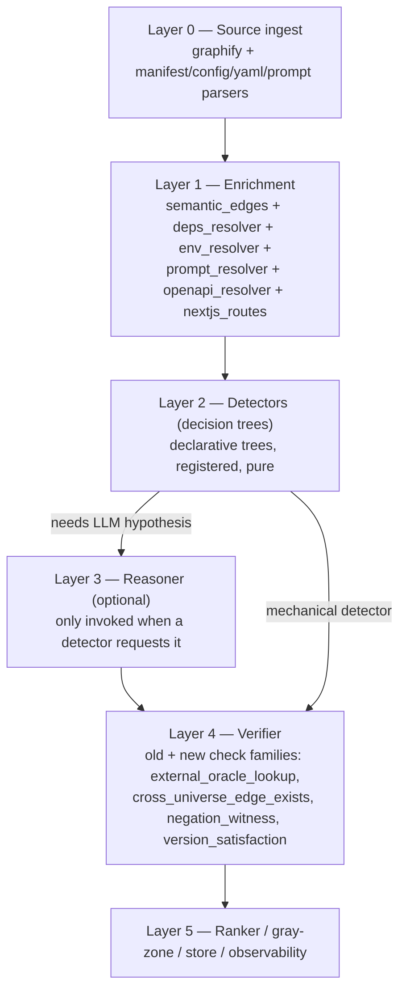

# Decision-Tree Detector Platform — depOS Intelligence v2

## 0. Goal and operating constraints

Build a generalized "many small decision trees" platform on top of the existing depOS intelligence pipeline so it can find:

- code-graph bugs (today)
- dependency / version mismatches across workspaces and lockfiles
- env / config drift (`.env`, `next.config.js`, `tsconfig.json`, `tailwind.config.ts`, `supabase/config.toml`)
- prompt/template format errors (missing fields, wrong types, undefined variables, drift across providers)
- HTTP/SQL/queue contract drift (request/response, enum, NOT NULL)
- auth/authorization gaps (Next App Router routes without session checks, RPCs without RLS or service_role, unsafe redirects)
- flow/control bugs (swallowed errors, unawaited promises, transactions left open)
- build / CI / infra mismatches (Dockerfile context, GH Actions secrets, matrix vs `engines`, compose networks)

Hard constraints from the existing codebase:

- Reuse existing 7-module shape in [depos/analysis/pipeline.py](depos/analysis/pipeline.py); detectors slot in as Module 2 candidate generators.
- Verifier in [depos/analysis/verifier.py](depos/analysis/verifier.py) stays the trust boundary; we add new check families, not new outcome enums (except `outcome_n/a` reserved for non-LLM detectors).
- Reasoner stays optional. Many decision trees are mechanical and never call an LLM.
- Persistence already lives in `intelligence_runs` / `intelligence_findings` ([20260417120500_init_intelligence_runs.sql](supabase/migrations/20260417120500_init_intelligence_runs.sql)). New tables are additive.
- Determinism and replay are non-negotiable: every detector run records `pipeline_version`, `detector_version`, and inputs sufficient to re-derive the candidate.

## 1. Architecture: layers and where decision trees fit



Each detector is one Python module + one Pydantic spec. The four hard-coded seed functions in [depos/analysis/candidate_identifier.py](depos/analysis/candidate_identifier.py) become four detectors registered in a registry.

## 2. New universes added to the graph

Each universe gets its own ingest module under `depos/ingest/` that produces nodes/edges merged into the same `nx.DiGraph` graphify produced. All node ids are namespaced: `pkg::npm:react@18.2.0`, `env::DATABASE_URL@apps/web/.env.local`, `prompt::auth_email@apps/web/lib/prompts/auth_email.md#v3`, etc.

Node and edge taxonomy added (single source of truth in `depos/analysis/schemas.py`):

- Node kinds: `package_manifest`, `package_dep`, `lockfile_resolution`, `env_var`, `config_key`, `prompt_template`, `openapi_operation`, `openapi_schema`, `next_route`, `next_middleware`, `infra_workflow`, `infra_service`, `dockerfile_stage`.
- Edge relations (added to [depos/enrichment/semantic_edges.py](depos/enrichment/semantic_edges.py) constants and `SemanticEdgeMetadata.contract_kind`):
  - `DECLARES_DEP`, `RESOLVES_TO`, `PEER_OF`, `IMPORTS_PACKAGE`
  - `READS_ENV_VAR`, `WRITES_ENV_VAR`, `DEFINED_BY_CONFIG`
  - `RENDERED_BY_PROMPT`, `PROMPT_DECLARES_VAR`, `PROMPT_USES_VAR`
  - `IMPLEMENTS_OPENAPI_OP`, `CONSUMES_OPENAPI_OP`, `SCHEMA_OF`
  - `NEXT_ROUTE_GUARDED_BY_MIDDLEWARE`, `NEXT_ROUTE_USES_LAYOUT`
  - `WORKFLOW_USES_SECRET`, `SERVICE_DEPENDS_ON`, `STAGE_COPIES_PATH`

## 3. File-by-file deliverables

Order matters: 3.1 → 3.2 → 3.3 → 3.4 → 3.5 → 3.6.

### 3.1 Schemas (single source of truth)

Edit [depos/analysis/schemas.py](depos/analysis/schemas.py). Append, do not edit existing classes:

- `class NodeKind(str, Enum)` listing every kind from §2.
- `class Universe(str, Enum)`: `code | deps | env | prompt | schema | nextjs | infra`.
- `class Detector(BaseModel)`:
  - `name: str` (kebab case, unique, registry key)
  - `version: str` (semver, bumped on logic change — used in audit rows)
  - `universe: Universe`
  - `applies_when: str` (DSL expression: see §4)
  - `tree: list[DetectorRule]`
  - `verifier_checks: list[str]` (names that must run on emitted candidates)
  - `requires_reasoner: bool = False`
  - `severity_default: Literal["info","low","medium","high","critical"] = "medium"`
  - `enabled_by_default: bool = True`
- `class DetectorRule(BaseModel)`: `if_: str` (DSL), `then: DetectorAction`, `description: str = ""`.
- `class DetectorAction(BaseModel)`: `emit: Literal["candidate","skip","stop"]`, `seed_type: SeedType = SeedType.graph_anomaly`, `extra: dict[str, Any]`, `priority_score: float = 0.6`, `witness_template: list[str] = []`.
- `class DetectorCandidateExtra(BaseModel)`: standard envelope inside `Candidate.extra` so the verifier knows which detector produced it: `detector_name`, `detector_version`, `pipeline_version`, `severity`, `oracle_hints: dict[str, Any]`.
- `class DetectorRunStats(BaseModel)`: `run_id`, `detector_name`, `detector_version`, `candidates_emitted`, `verified_confirmed`, `verified_invalid`, `mean_latency_ms`, `errors`.
- Extend `VerifierCheckResult.result` doc to include the new outcomes used in §3.5.
- Extend `RunMetadata` with `pipeline_version: str`, `detector_versions: dict[str, str]`, `enabled_detectors: list[str]`, `disabled_detectors: list[str]`, `universes_present: list[Universe]`, `ingest_errors: list[dict]`.

### 3.2 Layer 0 — ingest modules (one folder per universe)

Create the `depos/ingest/` package. Every module exposes `def ingest(graph: nx.DiGraph, *, repo_root: Path, config: IntelligenceConfig) -> IngestReport`. Failures append to `IngestReport.errors`, never raise.

- `depos/ingest/__init__.py` — registry: `INGESTORS: list[Callable]` in deterministic order; `def ingest_all(graph, repo_root, config) -> list[IngestReport]`.
- `depos/ingest/manifests.py` — parse `package.json`, `package-lock.json`, `pnpm-lock.yaml`, `yarn.lock`, `requirements*.txt`, `pyproject.toml`, `poetry.lock`, `Pipfile.lock`, `cargo.toml`, `cargo.lock`. Emit `package_manifest`, `package_dep`, `lockfile_resolution` nodes and `DECLARES_DEP`, `RESOLVES_TO`, `PEER_OF` edges. Use `packaging` (already a transitive dep) for PEP 440; vendor a tiny semver matcher (no new heavy deps).
- `depos/ingest/env_config.py` — parse `.env*`, `next.config.{js,ts,mjs}`, `tsconfig.json`, `tailwind.config.ts`, `supabase/config.toml`, `apps/web/.env.local*`. Use Python `dotenv` (already used downstream by [depos/env.py](depos/env.py)) for env, `tomllib` for toml, simple regex+JSON for js configs (best-effort, escape on syntax error). Emit `env_var`, `config_key` nodes plus `DEFINED_BY_CONFIG` edges. Match against `process.env.X` / `os.getenv("X")` references already in code; emit `READS_ENV_VAR` edges.
- `depos/ingest/prompts.py` — scan a configurable set of globs (default: `**/prompts/**/*.{md,toml,json,prompt}`, `**/.cursor/rules/*.md`, `**/agents/**/*.{md,toml}`). For each template, extract frontmatter, declared variables (`{{var}}` / `{var}` / `${var}`), and look up the per-template-family JSON Schema from `depos/ingest/prompt_schemas/` (a YAML registry). Emit `prompt_template` nodes with `schema_id`, `declared_vars`, `used_vars`, `frontmatter`, `provider`.
- `depos/ingest/openapi.py` — load OpenAPI 3 docs at configurable globs (default: `**/openapi.{yaml,yml,json}`). Emit `openapi_operation` and `openapi_schema` nodes; cross-link to FastAPI routes by `operationId` or by `(method, normalized_path)`.
- `depos/ingest/nextjs_routes.py` — walk `apps/web/app/**/{page,route,layout,middleware}.{ts,tsx,js,jsx}` plus `apps/web/middleware.ts`. Emit `next_route` nodes (with `is_server_component`, `methods`, `path`), `next_middleware` nodes, `NEXT_ROUTE_GUARDED_BY_MIDDLEWARE`, `NEXT_ROUTE_USES_LAYOUT`, and `WRITES_ENV_VAR`/`READS_ENV_VAR` from regex over the source.
- `depos/ingest/infra.py` — parse `Dockerfile*`, `docker-compose*.yml`, `.github/workflows/*.{yml,yaml}`, `supabase/config.toml`. Emit `infra_workflow`, `infra_service`, `dockerfile_stage` nodes plus `WORKFLOW_USES_SECRET`, `SERVICE_DEPENDS_ON`, `STAGE_COPIES_PATH` edges.

`IngestReport` shape in `depos/ingest/__init__.py`: `module: str`, `nodes_added: int`, `edges_added: int`, `files_seen: int`, `errors: list[{path, kind, message}]`. Aggregate into `RunMetadata.ingest_errors`.

### 3.3 Layer 1 — extend enrichment

Edit [depos/enrichment/semantic_edges.py](depos/enrichment/semantic_edges.py):

- Add the new edge constants from §2 and export them.
- After existing probes run, call new resolvers (lazy import, same `try/except` pattern but log to `coverage.errors`):
  - `depos/enrichment/deps_resolver.py` — cross-link `IMPORTS_PACKAGE` edges from existing code import nodes (graphify already extracts imports; match by package name) to `package_dep` / `lockfile_resolution` nodes; flag declared-vs-resolved drift inline by setting `metadata.confidence` and `metadata.extra["drift_kind"]`.
  - `depos/enrichment/env_resolver.py` — match `os.getenv` / `process.env.X` literals already on code nodes against env_var nodes; emit `READS_ENV_VAR` with confidence by source (defined-and-typed > defined > undefined).
  - `depos/enrichment/prompt_resolver.py` — match call sites that load templates (`load_prompt("auth_email")`, `Handlebars.compile(...)`, etc.) to `prompt_template` nodes; emit `RENDERED_BY_PROMPT` with the rendering call's variable bindings.
  - `depos/enrichment/openapi_resolver.py` — match FastAPI handlers / Next route handlers to OpenAPI operations; emit `IMPLEMENTS_OPENAPI_OP` / `CONSUMES_OPENAPI_OP`.
  - `depos/enrichment/nextjs_resolver.py` — match `next_route` nodes against `next_middleware` matchers; emit `NEXT_ROUTE_GUARDED_BY_MIDDLEWARE` (or absence in detector tree).
- Replace `try/except: pass` with a structured collector so the existing silent-failure problem is fixed once: introduce `_safe_run(probe_name, fn, errors_out)` and write entries into `coverage.errors` (need to add `errors: list[dict]` to `StitcherCoverageReport` in schemas).

### 3.4 Layer 2 — detector platform

New package `depos/analysis/detectors/`:

- `depos/analysis/detectors/__init__.py` — registry, loader, and runner:
  ```
  REGISTRY: dict[str, Detector] = {}
  def register(spec: Detector, runner: Callable) -> None
  def load_builtin() -> None     # imports all detector modules
  def run_all(graph, manifest, mode, config, policy) -> tuple[list[Candidate], list[DetectorRunStats]]
  ```
- `depos/analysis/detectors/dsl.py` — tiny safe expression evaluator for `applies_when` and `if_`. Whitelist:
  - identifiers: `node`, `edge`, `graph`, `manifest`, `config`, `now`, plus per-detector `ctx`
  - operators: `and`, `or`, `not`, `in`, `==`, `!=`, `<`, `<=`, `>`, `>=`
  - calls limited to a registered helper set in `dsl_helpers.py`: `has_edge(rel, src, dst)`, `count(rel)`, `attr(node, key)`, `regex(pattern, value)`, `version_satisfies(range, version)`, `schema_validate(schema_id, payload)`, `cross_universe(node)`, etc.
  - Implement with `ast.parse(mode="eval")` + a strict NodeVisitor; reject anything not in the whitelist. No `eval()`/`exec()`.
- `depos/analysis/detectors/policy.py` — load per-org `detector_policy` (see §3.5/§3.6 DB) into a `DetectorPolicy(enabled: set[str], disabled: set[str], severity_overrides: dict[str, str])`.
- One module per detector under `depos/analysis/detectors/builtin/`:

  Code-graph (replacements of existing seed functions, behavior-preserving):
  - `diff_anchor.py` — wraps `_diff_anchor_candidates`.
  - `interface_surface.py` — wraps `_interface_surface_candidates`.
  - `graph_anomaly.py` — wraps `_graph_anomaly_candidates`.
  - `lexical_keyword_seed.py` — replaces `_ai_driven_candidates`; same gate via `enable_ai_driven_seeds`.

  Dependency / supply chain:
  - `dep_version_mismatch_across_workspaces.py`
  - `lockfile_drift.py`
  - `peer_dep_unsatisfied.py`
  - `phantom_dep.py` (imported but not declared)
  - `unused_dep.py`
  - `vulnerable_dep.py` (uses `external_oracle_lookup` against advisory snapshot — see §6)
  - `transitive_pin_conflict.py`

  Config / env:
  - `env_var_referenced_but_undefined.py`
  - `env_var_defined_but_unused.py`
  - `env_var_typed_drift.py`
  - `next_route_protected_in_middleware_but_not_layout.py`
  - `cors_origin_omits_known_client_origin.py`
  - `redirect_target_not_safelisted.py`

  Prompt / template:
  - `prompt_missing_required_field.py`
  - `prompt_field_type_mismatch.py`
  - `prompt_references_undefined_variable.py`
  - `prompt_drift_between_provider_versions.py`

  Schema / contract:
  - `request_body_missing_required_field.py`
  - `response_field_consumed_but_not_produced.py`
  - `enum_value_used_but_not_in_schema.py`
  - `migration_adds_not_null_without_default.py`

  Auth / authorization (high-leverage given current stack):
  - `route_without_session_check.py`
  - `rpc_invoked_without_rls_or_service_role.py`
  - `password_reset_link_handler_redirects_to_external_origin.py`
  - `cookie_set_without_httponly_or_secure_in_prod.py`

  Flow / control (decision-tree forms of Mode C):
  - `error_swallowed_in_async_handler.py`
  - `awaitable_returned_unawaited.py`
  - `transaction_started_but_not_committed_on_all_branches.py`

  Build / CI / infra:
  - `dockerfile_copies_path_not_in_build_context.py`
  - `gha_workflow_uses_secret_not_declared.py`
  - `gha_matrix_node_version_diverges_from_engines.py`
  - `compose_service_depends_on_service_with_different_network.py`

  Each module exports two things: `SPEC = Detector(...)` and `def run(graph, manifest, mode, config, ctx) -> list[Candidate]`. The runner enforces that every emitted `Candidate.extra` is wrapped in `DetectorCandidateExtra`.

### 3.5 Layer 4 — verifier check families (extend [depos/analysis/verifier.py](depos/analysis/verifier.py))

Add these check functions and route them based on `Detector.verifier_checks`:

- `_check_external_oracle_lookup(detector, candidate, oracle)` — runs the oracle named in `candidate.extra.detector.oracle_hints`. Oracles registered in `depos/analysis/oracles/`:
  - `lockfile_resolver.py` — given `(declared_range, lock_resolution)` decide satisfies/conflicts.
  - `advisory_db.py` — given `(ecosystem, name, version)` look up local snapshot of OSV/GHSA (file-backed, no network at run time; refresh job in §10).
  - `json_schema.py` — validate a payload against a JSON Schema (uses `jsonschema` lib).
  - `openapi_lookup.py` — given `(method, path)` fetch the operation spec.
  - `semver.py` / `pep440.py` — version satisfaction.
- `_check_cross_universe_edge_exists(witness, required_pairs)` — generalization of `graph_path_exists`. Requires the witness path to traverse at least one edge whose `(source_universe, target_universe)` pair appears in the detector's spec.
- `_check_negation_witness(graph, claim)` — proves an absence (e.g., "no `NEXT_ROUTE_GUARDED_BY_MIDDLEWARE` edge from this route node"). Output `pass` only if the absence is provable from the cross-universe graph; otherwise `unavailable`.
- `_check_version_satisfaction(detector, candidate)` — pure semver/PEP440 check.

Fixes baked into the same edit (see §5 for rationale):

- Replace the description-text trigger in `_check_rls_awareness` with: trigger when any cited table has any incoming `ROUTE_GUARDED_BY_RLS` edge OR when the candidate originates from an RLS-related detector.
- Update `_derive_outcome` to require a minimum number of _executed_ checks (`pass + fail >= 2`) before promoting to `partially_confirmed`. Treat `unavailable` as a tie-breaker only.
- Add `outcome_n_a` path: detectors with `requires_reasoner=False` and at least one `pass` and zero `fail` jump straight to `confirmed` with `mode = None` and `reasoner_confidence = 1.0` (purely deterministic confirmation).

### 3.6 Layer 5 — pipeline + persistence + ranker wiring

Edit [depos/analysis/pipeline.py](depos/analysis/pipeline.py):

- Replace the call to `identify_candidates` with `detectors.run_all(...)`.
- For detectors with `requires_reasoner=False`, skip Modules 3-4 entirely and go directly to verifier.
- For the rest, keep the current bundle → reasoner → verifier path.
- Pass per-detector `DetectorRunStats` through to a new return shape: `RunResult(findings: list[Finding], detector_stats: list[DetectorRunStats], ingest_reports: list[IngestReport], run_metadata: RunMetadata)`.
- Bump `RunMetadata.pipeline_version`. Set `detector_versions` from the registry.

Ranker:

- Either delete `missing_guard_signals` from `phase_0_weights` in [depos/analysis/config.py](depos/analysis/config.py), or wire a feature in: have the new auth detectors flag `missing_guard_signals` count on their candidates and read it in [depos/analysis/ranker.py](depos/analysis/ranker.py:36). Plan: wire it. Add a `RankerDiffFeatures.missing_guard_signals: int` field, populate from `candidate.extra.detector.oracle_hints["missing_guard_signals"]` in `_build_ranker_input`.

Storage extension in [depos/intelligence_store.py](depos/intelligence_store.py):

- Persist `detector_stats` rows.
- Persist per-finding `detector_name`, `detector_version`, `pipeline_version`, `severity`.
- Persist `ingest_reports` summary on the run row.

API surface in [depos/api_server.py](depos/api_server.py):

- Extend `POST /v1/orgs/{slug}/intelligence/runs` to accept `detector_policy` overrides.
- Add `GET /v1/orgs/{slug}/intelligence/detectors` returning the registry plus current org policy.
- Add `PUT /v1/orgs/{slug}/intelligence/detectors/policy` to update policy (admin only — gated by existing `OrganizationMember.role`).

### 3.7 Observability

- New module `depos/analysis/observability.py` exposing structured logger context (`run_id`, `detector_name`, `version`) and per-stage timing.
- Detector runner records `mean_latency_ms`, `candidates_emitted`, `errors`.
- Verifier records per-check `pass/fail/unavailable` counts on the run.
- All written to JSONL alongside existing `ranker_phase0_examples.jsonl` plus persisted to Postgres (§4).

### 3.8 CLI

Edit [depos/cli/analyze.py](depos/cli/analyze.py):

- New flags: `--detectors include=...`, `--detectors exclude=...`, `--no-reasoner`, `--print-detector-stats`.
- New subcommand `depos detectors list` printing the registry (name, version, universe, `requires_reasoner`, default severity).
- New subcommand `depos detectors explain <name>` printing the spec tree and example witness.

## 4. Detector DSL spec

Tiny, deliberately under-powered. Three contexts:

- `applies_when`: evaluated once per node OR once per detector (mode chosen via `Detector.scope: Literal["graph","per_node","per_edge"]`, default `per_node`).
- `if_`: evaluated for each rule against the bound `node` / `edge` / `graph`.
- `then.witness_template`: a list of node-id format strings using `{node.id}`, `{edge.src}`, etc.

Examples (informal — the actual specs live next to each detector):

```
# dep_version_mismatch_across_workspaces.py
SPEC = Detector(
  name="dep_version_mismatch_across_workspaces",
  version="0.1.0",
  universe=Universe.deps,
  scope="per_node",
  applies_when="node.kind == 'package_dep'",
  tree=[
    DetectorRule(
      if_="count(siblings_with_same_pkg(node)) > 1 "
          "and not all_satisfy_common_range(node)",
      then=DetectorAction(
        emit="candidate",
        seed_type=SeedType.graph_anomaly,
        priority_score=0.78,
        extra={"drift_kind": "cross_workspace_range_disagreement"},
        witness_template=["{node.id}", "{node.parent_manifest_id}"],
      ),
      description="Two workspaces declare the same dep with incompatible ranges.",
    ),
  ],
  verifier_checks=["graph_path_exists", "version_satisfaction", "external_oracle_lookup"],
  requires_reasoner=False,
  severity_default="medium",
)
```

The DSL evaluator and helper set live in `dsl.py` / `dsl_helpers.py`. Test surface: each helper has a unit test; the evaluator has a small "rejects unsafe AST" test.

## 5. Bug-fix sweep (do alongside detector work; same PR optional)

Concrete code defects already in the pipeline; fix in this plan because new detectors will amplify them:

- [depos/analysis/verifier.py](depos/analysis/verifier.py:103) — `_check_rls_awareness` triggers on substring of `description`. Replace with graph-driven trigger described in §3.5.
- [depos/analysis/verifier.py](depos/analysis/verifier.py:165) — `_derive_outcome` promotes to `partially_confirmed` when most checks are `unavailable`. Require minimum executed-check count; see §3.5.
- [depos/enrichment/semantic_edges.py](depos/enrichment/semantic_edges.py:184) — silent `try/except: pass`. Replace with `_safe_run` collector and surface errors in `StitcherCoverageReport.errors` and `RunMetadata.ingest_errors`.
- [depos/analysis/ranker.py](depos/analysis/ranker.py:40) — `missing_guard_signals` zeroed out. Wire it in (see §3.6) or delete the weight from config. Plan: wire it.
- [depos/analysis/candidate_identifier.py](depos/analysis/candidate_identifier.py:487) — retire `_ai_driven_candidates` once `lexical_keyword_seed.py` detector covers it; keep only one seeding path.
- [depos/analysis/pipeline.py](depos/analysis/pipeline.py) — never invokes GraphCodeBERT despite docs claiming it does. Either wire it as a pre-ranker (see §11) or delete operational references in [docs/architecture.md](docs/architecture.md) and [docs/dataset-pipeline.md](docs/dataset-pipeline.md). Plan: wire it as opt-in pre-ranker behind `config.ranker.use_graphcodebert: bool = False`.

## 6. Oracles

New package `depos/analysis/oracles/`. Each oracle is a pure function with a small data file or local DB it loads at startup.

- `lockfile_resolver.py` — uses output of `depos/ingest/manifests.py`; pure.
- `advisory_db.py` — loads a snapshot under `data/advisories/` (gzipped JSONL of OSV records keyed by `(ecosystem, name)`). Refresh job in §10. Never network-hits at run time.
- `json_schema.py` — wraps `jsonschema.Draft202012Validator`.
- `openapi_lookup.py` — pure dict lookup over ingested OpenAPI nodes.
- `semver.py` — vendored small semver matcher (no `node-semver` shell out).
- `pep440.py` — wraps `packaging.specifiers.SpecifierSet`.

Each oracle exports `def lookup(question: dict) -> OracleResult` with `OracleResult(found: bool, conclusion: Literal["pass","fail","insufficient_evidence"], detail: str, source: str)`. The verifier `_check_external_oracle_lookup` adapts these into `VerifierCheckResult`.

## 7. Database migrations

Add Supabase migrations under `supabase/migrations/` (timestamps to be set at execution time, ascending after the latest existing migration):

- `..._intelligence_detector_stats.sql` — table `intelligence_detector_stats(run_id uuid fk -> intelligence_runs, detector_name text, detector_version text, candidates_emitted int, verified_confirmed int, verified_invalid int, mean_latency_ms numeric, errors jsonb, primary key (run_id, detector_name))`. RLS mirrors `intelligence_runs_member_select` via join, and a `service_role` `for all` policy.
- `..._intelligence_findings_add_detector_columns.sql` — `alter table intelligence_findings add column detector_name text not null default 'legacy'`, `add column detector_version text not null default '0'`, `add column pipeline_version text not null default '0'`, `add column severity text not null default 'medium' check (severity in ('info','low','medium','high','critical'))`. Backfill set via default; new index on `(run_id, detector_name)`.
- `..._intelligence_runs_add_pipeline_columns.sql` — `alter table intelligence_runs add column pipeline_version text not null default '0'`, `add column ingest_errors jsonb not null default '[]'::jsonb`, `add column universes_present jsonb not null default '[]'::jsonb`, `add column enabled_detectors jsonb not null default '[]'::jsonb`.
- `..._org_detector_policy.sql` — `alter table organizations add column detector_policy jsonb not null default '{"enabled":[],"disabled":[],"severity_overrides":{}}'::jsonb`. Add `is_org_admin()` helper if not already present, and policies allowing admins to update `detector_policy` only (column-level grant or row-level USING/CHECK that recomputes role).

Mirror SQLAlchemy models in [depos/db.py](depos/db.py): `IntelligenceDetectorStat`, plus columns added to `IntelligenceFinding`, `IntelligenceRun`, `Organization`.

## 8. Test plan

Each detector ships with three tests under `tests/detectors/<name>/`:

- `test_positive.py` — synthetic minimal graph that should trigger.
- `test_negative.py` — same shape modified so trigger should not fire.
- `test_verifier.py` — round-trip: detector emits candidate, verifier returns expected outcome.

Plus shared:

- `tests/dsl/test_safe_eval.py` — confirm DSL rejects `__import__`, attribute walks to dunders, `getattr` calls, lambdas, comprehensions with side effects, etc.
- `tests/oracles/test_advisory_db.py` — fixture-backed tests using a tiny advisory snapshot.
- `tests/ingest/test_*.py` — one per ingest module with realistic fixture trees under `tests/fixtures/`.
- `tests/pipeline/test_run_result_shape.py` — confirms the new `RunResult` is well-formed end-to-end against a fixture repo.

## 9. Rollout / phasing for Codex 5.4 to execute in order

```mermaid
flowchart LR
  P1[Phase 1<br/>Schemas + DSL + Registry +<br/>refactor existing 4 seeds into detectors] --> P2
  P2[Phase 2<br/>Verifier fixes + new check families +<br/>oracles scaffolding] --> P3
  P3[Phase 3<br/>Ingest: manifests + env_config<br/>+ enrichment resolvers] --> P4
  P4[Phase 4<br/>First two new detectors:<br/>dep_version_mismatch + env_var_referenced_but_undefined] --> P5
  P5[Phase 5<br/>DB migrations + persistence +<br/>API + CLI changes] --> P6
  P6[Phase 6<br/>Remaining ingest:<br/>prompts, openapi, nextjs_routes, infra] --> P7
  P7[Phase 7<br/>Remaining detectors by family<br/>auth, schema, flow, infra, prompt] --> P8
  P8[Phase 8<br/>GraphCodeBERT pre-ranker wiring or<br/>doc pruning + observability + advisories job]
```



Acceptance gate per phase:

- P1: existing tests still pass; one detector smoke test passes with the four refactored detectors emitting identical candidates to the legacy code on a fixture repo.
- P2: verifier unit tests pass including new check families; oracle unit tests pass.
- P3: ingest report on a fixture repo shows >0 nodes added per universe, 0 unhandled exceptions.
- P4: end-to-end pipeline run on the fixture surfaces both new findings, persisted with `detector_name`/`severity` set.
- P5: migrations apply cleanly on a fresh Supabase local; API returns the registry; CLI subcommands work.
- P6/P7/P8: each detector has tests + one runs in the fixture repo end-to-end.

## 10. Operational jobs (separate from per-run pipeline)

- `scripts/refresh_advisories.py` — fetches OSV / GHSA daily into `data/advisories/`. Cron / GH Action. Must be deterministic (write `advisories.lock` with content hash).
- `scripts/build_prompt_schema_index.py` — walks `depos/ingest/prompt_schemas/*.yaml` and validates them as JSON Schema 2020-12 at build time.
- `scripts/snapshot_detector_registry.py` — dumps the registry to `docs/detector-registry.md` so reviewers can see what's enabled.

## 11. GraphCodeBERT decision

Two acceptable outcomes, not both:

- Wire it as a pre-ranker behind `config.ranker.use_graphcodebert: bool = False`. Insert call in `pipeline.py` between `detectors.run_all` and the existing `_build_ranker_input`. Embedding scores feed a new `RankerDiffFeatures.graphcodebert_score: float` and weight in `phase_0_weights`. Update [depos/analysis/graphcodebert.py](depos/analysis/graphcodebert.py) to be lazy-imported and to no-op when the feature flag is off.
- OR delete the operational references in [docs/architecture.md](docs/architecture.md) and [docs/dataset-pipeline.md](docs/dataset-pipeline.md) and limit GraphCodeBERT to the dataset-only training-data path.

Plan baseline: do (1) under the flag, default off. Only flip the flag once a dataset run shows recall improvement on a held-out fixture.

## 12. Documentation

- New file `docs/detector-platform.md` covering the layered architecture, DSL grammar, how to add a detector (10-line template + checklist), and the cross-universe node/edge taxonomy.
- New file `docs/detector-registry.md` (auto-generated by §10 script).
- Update [docs/architecture.md](docs/architecture.md) to add Layer 0 (ingest) and Layer 2 (detectors) sections; remove or correct the GraphCodeBERT claim per §11.
- Update [docs/dataset-pipeline.md](docs/dataset-pipeline.md) to clarify which path uses GraphCodeBERT.
- New handoff `docs/handoffs/<date>-detector-platform.md` summarizing the rollout for teammates, parallel to the recent [docs/handoffs/2026-04-19-web-auth-landing-supabase.md](docs/handoffs/2026-04-19-web-auth-landing-supabase.md).
- Update [AGENTS.md](AGENTS.md) with a pointer to `docs/detector-platform.md`.

## 13. Definition of done

- All four legacy seed functions replaced by registered detectors with byte-identical candidate output on the fixture repo.
- At least one detector per universe (deps, env, prompt, schema, nextjs, auth, infra) shipping with positive + negative tests, persisted findings, and severity.
- Verifier emits structured outcomes with the new check families; bug-fix sweep in §5 closed.
- Migrations applied; API returns detector registry and accepts policy updates; CLI lists / explains detectors.
- Observability rows visible in Postgres for each detector across at least one real run.
- `docs/detector-platform.md` and the auto-generated registry checked in.
- GraphCodeBERT path either wired behind a flag or removed from docs — no third "claimed but unwired" state.
