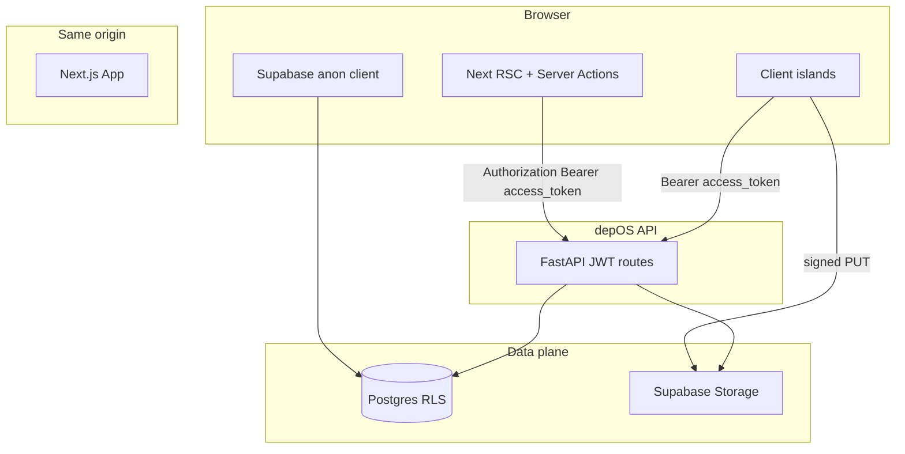

# depOS frontend — full product shell (Next.js 14)

## Scope and “100% coverage” definition

**Tenant FastAPI surface** (from [`depos/api_server.py`](depos/api_server.py)) that the browser must exercise:

| Area | Endpoints | UI home |
|------|-----------|---------|
| Session / org | `GET /v1/me`, `POST /v1/orgs` | Org switcher, create-org flow |
| Repos | `GET /v1/orgs/{slug}/repos`, `PATCH /v1/repos/toggle` | Repos table + admin toggles |
| Graph blobs | `POST .../graph-snapshots/prepare`, `POST .../{id}/complete` | Upload wizard (signed `PUT` to Storage URL returned by prepare) |
| Analyze | `POST /v1/ci/analyze` | “Analyze lab” — form + structured result |
| Post-CI | `POST /v1/ci/postci` | Post-CI form (shows API correlation payload) |
| Federation | `POST /v1/federation/snapshots` | Multi-repo snapshot merge (power tool) |
| Drift | `POST /v1/drift/snapshots` | Pick two ready snapshots, show Jaccard summary |
| Intelligence | `GET/POST /v1/orgs/{slug}/intelligence/runs`, `GET .../runs/{id}` | Runs list + detail (create run: **admin-only** — hide or degrade gracefully) |

**Reads without matching GET on FastAPI** (snapshots list, CI signal history, intelligence rows): Postgres already has **member `SELECT` RLS** on [`graph_snapshots`](supabase/migrations/20260418120000_init_graph_snapshots.sql), [`ci_signals`](supabase/migrations/20260417120400_init_ci_signals.sql), [`intelligence_runs` / `findings`](supabase/migrations/20260417120500_init_intelligence_runs.sql). The plan uses the **existing** [`@supabase/supabase-js`](apps/web/package.json) browser client for these lists after resolving `organizations.id` from slug (member-scoped `organizations` select exists per [`20260417120100_init_profiles_and_members.sql`](supabase/migrations/20260417120100_init_profiles_and_members.sql)). Mutations that need service/backend semantics stay on **FastAPI** (prepare/complete, analyze, postci, repo toggle, org create, intelligence create).

**Out of scope (by design):** internal-only routes (`/v1/snapshot`, `/v1/federation/preview`, `/v1/drift` with filesystem paths) — no UI; worker/CLI only.

---

## Frontend design (mandatory) — compound-engineering skill

Implementation **must** follow the **frontend-design** workflow: `Detect context → Plan the design → Build → Verify visually`. Skill file: `compound-engineering` → `skills/frontend-design/SKILL.md` in the Cursor compound-engineering plugin cache (same content as user-attached **frontend-design** skill).

### Authority hierarchy (per skill)

1. **Existing codebase** — highest: today [`apps/web/app/globals.css`](apps/web/app/globals.css) already defines `--bg`, `--fg`, `--accent`, `--muted`, `--card`, `--border` and a simple `.card` / `.grid`. **Extend and refine** these tokens and layout; do not throw them away for an unrelated palette unless consciously rebooting.
2. **User explicit instructions** — override defaults.
3. **Skill defaults** — apply where the codebase is silent (no component library yet → Radix + hand-styled primitives; no motion lib → CSS transitions).

### Layer 0: context detection → mode

**Detected signals:** CSS variables + minimal layout in `globals.css`; no Tailwind, no shadcn, no Framer; typography is generic system stack today.

**Classification: Partial system (1–3 signals).** Inherit existing dark variables and spacing feel; apply skill guidance for **typography pairing**, **composition**, **motion**, and **anti-slop** rules in gaps. New work must read as **one system** (Module C: new components inherit the updated token scale and radius discipline).

### Layer 1: pre-build planning (write these before coding UI)

Three short statements (checkpoint for the implementer or agent — paste into PR or issue):

1. **Visual thesis** — one sentence (mood, material, energy). *Default direction for depOS:* “Industrial dark console: cool deep base, one sharp accent for actions and graph-health, monospace only for data/code — editorial serif or sharp display for page titles only.”
2. **Content plan** — ordered blocks per surface: **Marketing `/`:** hero (brand + promise + single primary CTA) → one concrete proof strip → workflow depth → final CTA (max ~4–6 sections; one H1). **App `/orgs/*`:** shell (org context + nav) → primary workspace (page-specific) → secondary panel only where needed (e.g. JSON inspector). **Auth:** orientation + form + error; no marketing fluff.
3. **Interaction plan** — 2–3 **specific** motions (not “add animations”): e.g. (a) shell nav link hover + active rail indicator with 180ms ease, (b) staggered opacity on marketing hero lines on load with `prefers-reduced-motion: reduce` = no stagger, (c) analyze result panel expand/collapse height transition.

### Layer 2: design guidance (execute against this)

| Area | Rule |
|------|------|
| **Typography** | Two faces max: `next/font` **display** for H1/H2 + **UI sans** for body/UI (skill: avoid Inter/Roboto/Space Grotesk as the *only* voice). Keep body highly readable for dense tables. |
| **Color** | Cohesive CSS variables; **one dominant accent** + warning/danger for errors; no purple-on-white cliché; no decorative gradient that carries no meaning. |
| **Composition** | Skill: “Start with composition, not components”; default **cardless** where a panel is just layout — use cards only for **interactive** units (clickable repo row, snapshot upload zone, wizard step). App: calm surface hierarchy, strong type scale, minimal chrome. |
| **Motion** | 2–3 intentional motions (Layer 1); CSS baseline; add Framer Motion only if a marketing entrance needs orchestration — not required for v1. |
| **Accessibility** | Semantic regions (`nav`, `main`, `section`), WCAG AA contrast, visible **focus** states on all controls (skill quality floor). |
| **Imagery** | No stock hero art; optional abstract CSS texture only. |

### Context modules (which skill module applies)

| Surface | Module | Notes |
|--------|--------|--------|
| `/`, public marketing | **A** — Landing & marketing | Hero = one composition (not a dashboard); brand → headline → body → CTA; copy in **product language** (skill: no “seamless integration” voice). |
| `/orgs/*` console | **B** — Apps & dashboards | Dense, scannable; headings are **operational** (“Snapshots”, “Post-CI correlation”); operator can understand page from headings + numbers alone. |
| Buttons, inputs, toggles shared with auth | **C** — Components in existing app | Match the evolved token scale and radius; full state matrix: default / hover / active / disabled / loading / error. |

### Hard rules & anti-patterns (skill defaults — do not ship these)

- Generic SaaS **card grid** as the first impression on marketing.
- Purple-on-white / timid evenly-distributed rainbow accents.
- Hero cluttered with stat pills, logo clouds, or carousels with no narrative.
- **Prompt-language** or AI commentary anywhere in UI copy.
- Div-only chrome where `button`, `nav`, `main` apply.
- Interactive elements without visible focus rings.

### Litmus checks (before merge)

Answer **yes** where relevant: Is depOS unmistakable in the first screen? One strong visual anchor? Headings-only scan understandable? Each section one job? Cards only where interaction demands? Motion improves hierarchy? Copy sounds like **product**, not a prompt? New screens match the **same** system as login/repos (Module C)?

### Visual verification (after implement)

Per skill cascade: (1) Use Playwright only if added to the project for this purpose — **not** required to add only for screenshots. (2) If browser MCP is available, one pass: home, org dashboard, analyze result. (3) Else: screenshot + self-review against Layer 1 thesis and litmus list, and note “visual verification: manual” in PR.

---

## Design tokens & components (concrete execution)

These implement Layer 2 without contradicting Layer 0:

1. **Typography:** `next/font` — display for titles + neutral UI sans for tables/forms (avoid Inter-only).
2. **Color:** evolve `:root` layers (bg-elevated, border-subtle, accent, danger) — keep dark continuity with existing `--bg` feel.
3. **Layout:** persistent **app shell** — left rail (org + nav) + content; max-width constraint **only** on marketing. Dense tables for repos, signals, runs.
4. **Primitives:** small set on **Radix** (Dialog, DropdownMenu, Switch, Label) — **do not** dump full shadcn defaults; style with project tokens.
5. **Imagery:** none or subtle CSS grid/noise behind marketing hero only.

---

## Information architecture and routing

| Route | Purpose |
|-------|---------|
| [`/`](apps/web/app/page.tsx) | Public marketing: value prop, CTA to login/signup, link to docs |
| `/login`, `/signup` | Polished auth (existing Supabase flows), shared layout |
| `/orgs` | If single membership → redirect to `/orgs/{slug}`; else org cards |
| `/orgs/[slug]` | Dashboard: API health strip, quick links, recent signals snapshot |
| `/orgs/[slug]/repos` | Repos list + **PATCH toggle** (analysis / federated) — admin-gated UI for toggles |
| `/orgs/[slug]/snapshots` | Supabase list of snapshots + **prepare → file pick → PUT → complete** wizard |
| `/orgs/[slug]/analyze` | Form: repo, optional `changed_files`, hop depth, optional SARIF JSON paste/upload → `POST /v1/ci/analyze` — render [`LLMGraphExport`](depos/models.py) (executive summary, blast block, error counts; expandable JSON) |
| `/orgs/[slug]/postci` | Form: head SHA, predicted files, failed paths, conclusion, optional `graph_snapshot_id` → show response |
| `/orgs/[slug]/ci` | **Supabase** `ci_signals` table for org (filter by repo optional) |
| `/orgs/[slug]/federation` | Build `snapshot_ids` map (repo → UUID) → call federation snapshots → summary + download JSON |
| `/orgs/[slug]/drift` | Two snapshot pickers → drift result |
| `/orgs/[slug]/intelligence` | List runs (API **or** Supabase select); detail via `GET .../runs/{id}`; “New run” only if `/v1/me` implies admin (see below) |

**Middleware** ([`apps/web/middleware.ts`](apps/web/middleware.ts)): change protection from flat `/repos` to **`/orgs` prefix** (and any future `/settings`). Keep `/login` public.

**Admin detection for UI:** FastAPI `GET /v1/me` returns `memberships: [{ org_slug, role }]`. Treat `role in ('owner','admin')` as admin for showing repo toggles and “New intelligence run”. Members still see read-only repos and intelligence.

---

## Engineering layers

1. **`lib/depos/types.ts`** — TypeScript types aligned with API JSON (`LLMGraphExport`, blast radius, federation/drift responses). Optional **Zod** schemas for runtime parse of analyze responses in client islands.
2. **`lib/depos/api.ts`** — Thin `fetch` wrapper: `baseUrl` from `process.env.NEXT_PUBLIC_DEPOS_API_URL`, attaches `Authorization: Bearer ${accessToken}`, normalizes errors (`401` → sign-in hint, `403` → permission copy).
3. **`lib/depos/server.ts`** — For **Server Actions** / RSC: `createClient()` from [`@/lib/supabase/server`](apps/web/lib/supabase/server.ts), `getSession()`, call `api.ts` with `session.access_token` so secrets never need a separate “API key” in the browser beyond the user JWT (already the model).
4. **`lib/supabase/queries.ts`** — Browser (and optionally server) helpers: `getOrgIdBySlug(supabase, slug)`, `listGraphSnapshots(orgId)`, `listCISignals(orgId)`, `listIntelligenceRuns(orgId)` — all `select` only, RLS-enforced.
5. **Server Actions** (e.g. `app/orgs/[slug]/actions.ts`) — `createOrg`, `toggleRepo`, `prepareSnapshot`, `completeSnapshot`, `runAnalyze`, `runPostci`, `runFederation`, `runDrift`, `createIntelligenceRun` — each validates input, calls FastAPI, `revalidatePath` for the org segment.
6. **Components** (suggested dirs): `components/shell/` (AppShell, Sidebar, TopBar, OrgSwitcher), `components/ui/` (Button, Input, Card, Badge, DataTable, EmptyState, Skeleton), `components/domain/` (BlastSummary, ErrorIndexSummary, JsonPanel).

**Signed upload:** `prepare` returns `signed_url`; the **browser** must `fetch(signed_url, { method: 'PUT', body: file, headers: { 'Content-Type': 'application/json' }})` — implement in a small client component; then Server Action `complete` with optional `expected_sha256` (compute SHA-256 in browser via Web Crypto before complete if you want strict verification UX).

**CORS / env:** Dev: add `http://localhost:3001` (or your Next port) to API `DEPOS_CORS_ORIGINS`. Document in [`apps/web/.env.local.example`](apps/web/.env.local.example). Production: same for your web origin.

---

## Coverage checklist (acceptance)

- [ ] Logged-out user hits `/orgs/...` → redirect to login with `next` param (middleware).
- [ ] `POST /v1/orgs` from UI creates org; user lands on `/orgs/{slug}`.
- [ ] `/v1/me` drives org switcher; multi-org works.
- [ ] Repos: list + toggles call `PATCH /v1/repos/toggle`; non-admin sees read-only state.
- [ ] Snapshots: list via Supabase; happy path prepare → PUT file → complete → snapshot `ready`.
- [ ] Analyze: uses `graph_snapshot_id` of a **ready** snapshot; displays executive summary + blast + expandable raw JSON.
- [ ] Post-CI: successful `POST /v1/ci/postci`; optional `graph_snapshot_id` validated when org present (matches API).
- [ ] CI history page reads `ci_signals` via Supabase for that org.
- [ ] Federation + drift pages call respective POST endpoints and show results (numbers + JSON export).
- [ ] Intelligence: list + detail; create visible only for admin roles; 403 handled with clear copy.
- [ ] Marketing home and auth pages match the same design system.
- [ ] Empty states and loading skeletons on every list.

---

## Optional backend tweak (only if you refuse Supabase reads in web)

If product policy is “**all** data through FastAPI only,” add thin `GET` list endpoints mirroring RLS. Not required given current RLS + same Supabase project.

---

## Testing and quality bar

- Manual smoke script in plan execution: login → create org → prepare/complete snapshot → analyze → postci.
- **Design gate:** complete todo `design-skill-gates` (Layer 1 statements recorded; post-build litmus + one visual verification pass per skill).
- Add `eslint` + `eslint-config-next` if `next lint` is to be meaningful (currently minimal devDeps in [`apps/web/package.json`](apps/web/package.json)).
- Optional follow-up: Playwright e2e against `supabase start` + `depos-api` (out of scope unless you ask).
