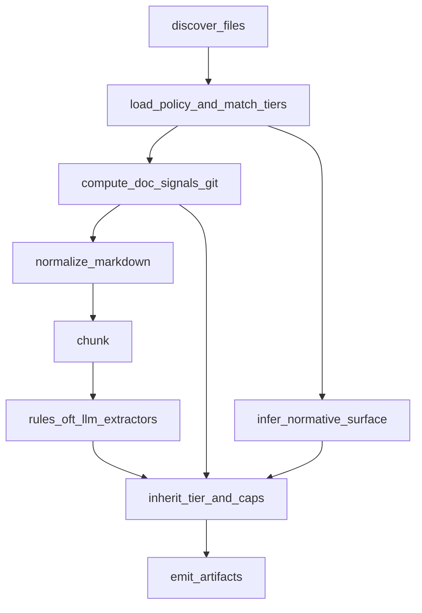

# Plan: Doc evidence, policy tiers, and normative surface

## Goals (what “discussed” maps to)

1. **Normative vs informative** — Only a declared normative surface can behave as “binding”; everything else defaults lower tier unless policy elevates it.
2. **Policy-as-code** — Human-reviewed YAML declares globs, default tier, per-path tier overrides, excludes.
3. **Freshness / ownership signals** — Per-file, explainable metadata (git commit time at minimum; optional staleness heuristics later).
4. **Tiered consumption contract** — IR carries **`effective_tier`** (`P0` | `P1` | `P2`) and optional **`max_downstream_severity`** so Graphical Context can implement: P0 may block, P1 PR nudge, P2 quiet unless verbose.
5. **Continuous reconciliation** — All of this runs on **every** `intent-context build` (v1 full recompute; optional later: hash cache / incremental).

**Non-goals for this slice:** Removing or replacing the OFT merge ([`oft_markdown_v0`](depos/intent_context/oft_markdown_v0.py), [`tag_scan`](depos/intent_context/tag_scan.py)); it remains the **high-precision normative lane** where authors opt in.

---

## Architecture (pipeline order)

---

## 1. Policy model (extend `.depos/intent.yaml`)

Extend [`depos/intent_context/intent_yaml.py`](depos/intent_context/intent_yaml.py) (or split `intent_policy.py` if cleaner) to parse additional keys from the same file:

- `default_tier`: `P2` (safe default: non-binding unless proven otherwise).
- `tier_rules`: ordered list of `{ glob, tier }` (first match wins; document precedence in docs).
- Optional `normative_markers`: toggles for treating `normative: true` frontmatter, OFT-backed chunks, ADR paths as bumps (see below).

Return a resolved **`DocPolicy`** object: `default_tier`, `rules: list[TierRule]`, raw parse warnings.

**Precedence (document in [`docs/intent-context.md`](docs/intent-context.md)):** explicit `tier_rules` match > inferred normative bump > `default_tier`.

---

## 2. Schemas (machine contract for downstream)

Update [`depos/intent_context/schemas.py`](depos/intent_context/schemas.py):

- **`IntentTier`** literal: `P0` | `P1` | `P2`.
- **`IntentManifestFile`**: add `policy_tier` (tier from policy only), `doc_signals` (nested small model: `last_commit_iso` or `last_commit_unix`, `commit_author` optional, `signals_version`), `normative_inference` (`none` | `frontmatter` | `oft_id` | `policy_glob` | `combined`), `effective_tier` (after inference), `doc_warnings` (e.g. git unavailable).
- **`IntentChunkRecord`**: add `effective_tier`, `normative_surface` (bool or enum), `source_relpath` already ties inheritance.
- **`IntentUnit`**: add `effective_tier`, `normative_surface`, `effective_confidence_cap` (float 0–1 derived from tier, e.g. P2 caps LLM/rules output), preserve existing `confidence` as “extractor confidence” or document dual meaning—prefer adding **`extractor_confidence`** only if you want to avoid breaking consumers; v1 can cap in place and document.

Emit optional **`intent_doc_signals.jsonl`** (one row per discovered doc file) mirroring manifest file entries for tools that only want signals without full manifest.

---

## 3. Doc signals module (git-first)

New module e.g. [`depos/intent_context/doc_signals.py`](depos/intent_context/doc_signals.py):

- For each discovered file path, run **`git log -1 --format=... -- path`** from `repo_root` (same pattern as [`build._repo_sha`](depos/intent_context/build.py)); on failure (not a git repo, shallow clone), record warning and leave timestamps null.
- v1 **staleness heuristic (optional flag):** if `IntentContextConfig.enable_churn_hint` and git available, optional second call or use `git log -1 -- path` on a sibling `src/` glob—defer to phase 1b if scope creep; plan can list as follow-up.

---

## 4. Normative surface inference (v1 rules)

New small module e.g. [`depos/intent_context/normative.py`](depos/intent_context/normative.py):

- **Frontmatter:** parse leading YAML in raw file (reuse lightweight approach from [`depos/ingest/prompts.py`](depos/ingest/prompts.py) `_frontmatter` or duplicate minimal 30 lines to avoid coupling)—`normative: true` bumps tier at most to P1 unless policy already set P0.
- **OFT:** if chunk will contain `oft_markdown_v0` units (or text matches `` `type~name~rev` ``), mark `normative_surface=true` and floor tier at **P1** unless policy says P2 for that path.
- **ADR / policy paths:** optional glob list from policy `normative_paths` bump P1.

No LLM required for v1 normative inference (keeps build deterministic); optional later: LLM **suggests** tier deltas only under env flag.

---

## 5. Wire into [`build.py`](depos/intent_context/build.py)

After `discover_intent_files`, for each file:

1. Resolve **policy tier** from globs.
2. Compute **git signals**.
3. After normalize+chunk, set chunk **`normative_surface`** / adjust tier from normative rules.
4. After all extractors produce units, set each unit’s **`effective_tier`** = min aggressiveness? Actually use **max binding**: P0 wins over P1 over P2 (define `tier_rank` int).
5. Apply **`effective_confidence_cap`** by tier (e.g. P2 cap 0.45 for non-OFT LLM units; P0 cap 1.0)—implement as `min(unit.confidence, cap)` into a new field **`downstream_confidence`** OR mutate `confidence` with documented behavior—pick one and document.

Aggregate manifest: counts by tier, list of P0 files, warnings.

---

## 6. Config ([`depos/analysis/config.py`](depos/analysis/config.py))

Add to `IntentContextConfig`:

- `default_doc_tier` string default `P2`
- `enable_doc_git_signals: bool = True`
- Optional `staleness_…` later

Wire env overrides `DEPOS_INTEL_INTENT_DEFAULT_TIER`, `DEPOS_INTEL_INTENT_GIT_SIGNALS=0|1`.

---

## 7. Tests and docs

- **Tests:** [`tests/intent_context/`](tests/intent_context/) — fixture with `.depos/intent.yaml` tier_rules; fixture markdown with `normative: true`; assert manifest file `effective_tier` and chunk inheritance; mock git or skip when not in git repo using monkeypatch.
- **Docs:** extend [`docs/intent-context.md`](docs/intent-context.md) with “Doc evidence & tiers”, YAML examples, merge order with OFT, and **downstream contract** (P0/P1/P2 semantics).

---

## 8. Graphical Context (out of scope here, but interface freeze)

Document that the consumer **must** use `IntentUnit.effective_tier` (or manifest per-file tier) when escalating “doc vs graph” to severities—no change required in detector core until you wire it.

---

## Implementation order (recommended)

1. Schemas + policy YAML parsing + docs.
2. `doc_signals.py` (git) + manifest file fields.
3. `normative.py` + chunk/unit inheritance in `build.py`.
4. Optional `intent_doc_signals.jsonl`.
5. Tests.
