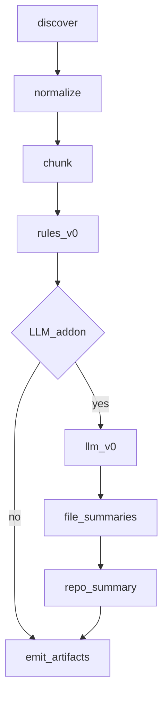

# Intent Context Layer (baseline) + LLM add-on

## Relationship to the baseline plan

This plan **subsumes** [intent_context_layer_ba87a314.plan.md](intent_context_layer_ba87a314.plan.md). Nothing from that plan is dropped: schemas, discovery/classification, normalization/chunking, **rules-based extraction**, CLI, tests, documentation, **provenance guardrails**, **byte caps**, and **Graphical Context Layer handoff** are all in scope. **LLM (`llm_v0`) and hierarchical summaries** are an **add-on** on top: enabled when `OPENAI_API_KEY` is available (and `llm_mode` is not `rules`), they **add** structured units and summary artifacts without removing the deterministic path.

| Baseline item (ba87a314) | Here |
|--------------------------|------|
| C1 `intent_manifest.json`, `intent_chunks.jsonl`, `intent_units.json`, IntentUnit fields + `extractor` | Same contract; manifest gains optional LLM stats / truncation |
| C2 `discover.py`, denylist, default globs, optional `.depos/intent.yaml` | Explicit: `intent.yaml` for globs/excludes |
| C2 `classify_path.py` / `mixed` tagging | Explicit todo |
| C3 `normalize.py`, `chunk.py`, fenced code sidecar, heading stack | Same |
| C4 pluggable **IntentExtractor**: `rules_v0` + optional `llm_v0` | **rules_v0 always implemented**; **llm_v0** when add-on active |
| C5 CLI `intent-context build`, pipeline order doc | Same + `--intent-llm` |
| C6 tests: headings, fenced code, golden `rules_v0` | Same + mocked LLM test |
| C7 stable schema + handoff spec for Graphical Context Layer | Explicit deliverable (one-page input spec) |
| Guardrails: provenance, SHA, confidence; fenced code not confused with shipped behavior | Restated in Requirements |
| Non-goals: no graph edges from LLM, no SARIF, claims not “confirmed bugs” | Out of scope unchanged |
| Per-file and total byte caps | Explicit in discover/config |

## Requirements (guardrails from baseline Part A)

- Every **IntentUnit** remains a **claim with provenance** (source path, heading context via chunk, hashes where useful), **confidence**, **commit/repo SHA** on the manifest—not an uncited truth blob.
- Fenced code: **strip or label** per config (quoted intent vs ignore) so downstream layers do not treat examples as production behavior.
- **Do not** embed intent into graphify as structural truth; **do not** add graph edges from LLM output without the separate Graphical Context verification story.

## LLM as add-on (behavior)

- **`llm_mode: auto` (default):** If `OPENAI_API_KEY` is set (via existing [`load_config_from_env()`](depos/analysis/config.py)), run **`llm_v0`** in addition to **`rules_v0`** and emit optional **`intent_file_summaries.jsonl`** / **`intent_repo_summary.json`**. If no key, run **`rules_v0` only** (no network)—matches baseline “deterministic fallback.”
- **`llm_mode: rules`:** Never call the API; baseline-only output.
- **`llm_mode: llm`:** Require a key; fail fast with a clear error if missing (for operators who want to guarantee LLM-enriched runs).

**Extractor tagging:** Units from regex/heuristics use `extractor: rules_v0`; units from the model use `extractor: llm_v0`. v1 may emit **both** without automatic dedupe; document how the Graphical Context Layer should prefer or merge (simple rule: prefer higher confidence or prefer `llm_v0` when both cite the same chunk—implementation choice documented in handoff spec).

## Implementation notes

- **Reuse:** `OPENAI_API_KEY` / `OPENAI_MODEL`, [`OpenAIProvider`](depos/analysis/reasoning_engine.py), JSON repair/validate patterns ([`_strip_fences_and_trailing_commas`](depos/analysis/reasoning_engine.py), etc.); thin client under `depos/intent_context/` if needed to avoid import cycles.
- **Package:** [`depos/intent_context/`](depos/intent_context/) — `discover.py`, `normalize.py`, `chunk.py`, `classify_path.py`, `extract.py` (registry: `rules_v0`, `llm_v0`), `schemas.py`, `build.py`.
- **Pipeline order:** discover → normalize → chunk → **rules_v0** → **(optional) llm_v0** → **(optional) file/repo summaries** → emit. Summaries after units so prompts can reference stable `chunk_id`s.

## Artifacts

- **Baseline:** `intent_manifest.json`, `intent_chunks.jsonl`, `intent_units.json` (units from one or both extractors).
- **Add-on:** `intent_file_summaries.jsonl`, `intent_repo_summary.json` when LLM path ran; manifest fields for `llm_enabled`, model id, call/token counts, truncation warnings.

## CLI and docs

- `depos-intel intent-context build` in [`depos/cli/__init__.py`](depos/cli/__init__.py) / [`depos/cli/analyze.py`](depos/cli/analyze.py).
- [`docs/intent-context.md`](docs/intent-context.md): artifacts, caps, env, ordering vs graphify (same diagram as baseline: checkout → intent → graphify → gctx), relationship to [`depos/ingest/prompts.py`](depos/ingest/prompts.py) for glob hygiene only.

## Testing

- Golden path: **rules only**, chunk boundaries, fenced code, heading stacks.
- Mocked HTTP or provider injection: **`llm_v0`** JSON validates against schemas; manifest flags when add-on runs.

## Out of scope (unchanged from baseline + prior LLM plan)

- Graphical Context Layer implementation.
- Anthropic/Azure (extension point later).
- Auto graph mutation or SARIF from intent.
