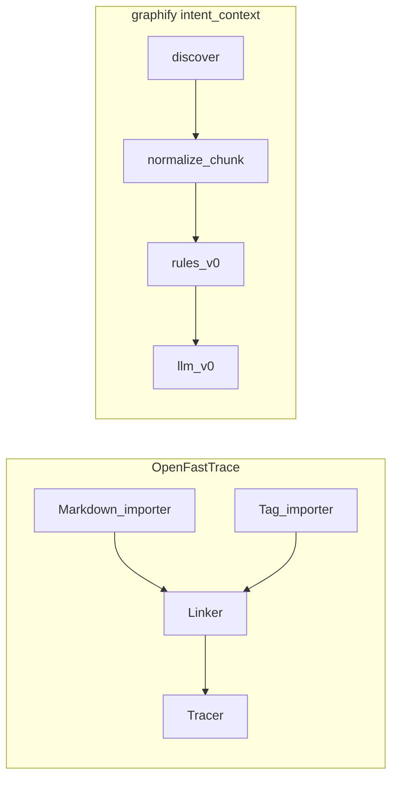

# OpenFastTrace vs graphify intent: analysis and merge strategy

## What OpenFastTrace actually is

From [doc/user_guide.md](/Users/yashvijay/Desktop/openfasttrace/doc/user_guide.md) and [doc/spec/design.md](/Users/yashvijay/Desktop/openfasttrace/doc/spec/design.md), OFT is a **requirement tracing suite**, not an “intent guesser”:

- **Specification item**: the atomic normative unit. In Markdown it is anchored by a **stable ID**: `` `artifact~name~revision` `` (e.g. `req~auth-timeout~1`). **Artifact type** encodes role in a **tracing hierarchy** (`feat`, `req`, `arch`, `dsn`, `impl`, `utest`, …—conventions, not a hardcoded enum in code).
- **Informative vs normative**: prose that does not carry a spec ID is context; normative blocks are what must be covered.
- **Coverage contract**: `Needs:` lists which **artifact types** must appear downstream to “cover” this item. **Deep coverage** means the chain continues until **terminating** items (e.g. `impl` / tests that need nothing else).
- **Explicit links**: `Covers:` (this item refines / implements upstream IDs), `Depends:` (ordering / constraint graph for exporters like `aspec`).
- **Revision semantics**: bumping **revision** deliberately **breaks** stale links so humans re-verify after semantic edits—central to OFT’s audit story.
- **Authoring guards**: `<!-- oft:off -->` … `<!-- oft:on -->` excludes regions from parsing (examples, accidental markers).
- **Delegation**: `arch --> dsn : req~foo~1` forwards work across layers without duplicating a new item.
- **Tags**: filter large specs by component/team.
- **Implementation side**: [Tag importers](/Users/yashvijay/Desktop/openfasttrace/importer/tag/) scan source for coverage markers like `// [impl->dsn~validate-authentication-request~1]` ([skills/openfasttrace-skill/SKILL.md](/Users/yashvijay/Desktop/openfasttrace/skills/openfasttrace-skill/SKILL.md))—regex-based, language-agnostic via comments.

Architecture (design doc): **Importers → specification list builder → Linker → Tracer → Reporter/Exporter**. Your pipeline today: **discover → normalize → chunk → rules_v0 → (optional) llm_v0 → summaries → JSON artifacts** in [`depos/intent_context/`](/Users/yashvijay/Desktop/graphify/depos/intent_context/).

## How this aligns with “pursue intent”

| Your intent (graphify) | OFT’s intent | Alignment |
|------------------------|--------------|------------|
| Treat docs as **claims**, not compiler truth | Same: normative items are claims; tracing proves **coverage** | Strong philosophical match |
| **Provenance** (file, chunk, lines) | Provenance (file, line, **stable ID**, revision) | OFT is **stricter** on identity; you are **richer** on fuzzy prose |
| Optional **LLM** for unstructured docs | OFT is **authoring-disciplined** Markdown + tags; no LLM core | Complementary: LLM fills gaps OFT refuses to guess |
| Downstream **graph** (AST truth) | Downstream **tags in code** + trace graph | Same *separation of concerns*; different bridge: **tags** vs **graph nodes** |

**Bottom line:** OFT is the best open-source reference for **making intent auditable and linkable**. Your layer is the best place for **discovering and packaging intent at scale** (including messy READMEs). The “flawless” system is **OFT discipline where teams opt in** plus **your pipeline everywhere else** plus a **future linker** that connects OFT IDs and/or LLM units to graphify’s graph.

---

## What to adopt from OFT (high value, feasible in graphify)

1. **OFT ID parsing as a first-class path**  
   Regex for `` `type~name~rev` `` (and optional title/`Needs`/`Covers`/`Status`/`Rationale` blocks in the same chunk). Emit [`IntentUnit`](/Users/yashvijay/Desktop/graphify/depos/intent_context/schemas.py) (or a sibling record) with fields such as `spec_item_id`, `artifact_type`, `revision`, `needs_artifact_types`, `covers_ids`, `status`, `rationale_excerpt`. **Extractor** name e.g. `oft_markdown_v0`.  
   *Effect:* zero-friction for repos that already use OFT; deterministic IDs beat LLM-invented IDs.

2. **`<!-- oft:off -->` / `<!-- oft:on -->` in [`normalize.py`](/Users/yashvijay/Desktop/graphify/depos/intent_context/normalize.py)**  
   Mirror OFT’s scan guards so examples and embedded OFT tutorials do not pollute units (same family as your fenced-code policy).

3. **Code-side coverage tag scan (OFT-compatible)**  
   New pass (e.g. `tag_scan.py`): walk configured code globs, find `[impl->req~foo~1]` / long-tag forms from OFT’s tag importer patterns ([`LongTagImportingLineConsumer`](/Users/yashvijay/Desktop/openfasttrace/importer/tag/src/main/java/org/itsallcode/openfasttrace/importer/tag/LongTagImportingLineConsumer.java)), emit **`intent_coverage_tags.jsonl`** with `{spec_item_id, relpath, line}`.  
   *Effect:* bridges **intent IR** to **repo files** the same way OFT bridges to implementation—later your Graphical Context Layer can join tags to AST nodes by path/line.

4. **Revision + status in the manifest**  
   When OFT IDs are present, compute a small **inventory** in [`intent_manifest.json`](/Users/yashvijay/Desktop/graphify/depos/intent_context/build.py): counts by artifact type, list of referenced IDs, optional warning if the same `type~name~` appears with multiple revisions in one run.  
   *Effect:* surfaces **stale-coverage risk** without running Java OFT.

5. **Optional “trace hint” export (aspec-inspired, not full aspec)**  
   Minimal JSON: nodes = spec IDs + tag locations; edges = Covers/Needs/impl-links. Full XML aspec compatibility is **not** required for v1.

6. **Prompt enrichment for `llm_v0`**  
   When a chunk contains parsed `Rationale:` / `Comment:` / `Depends:`, prepend structured context to the LLM prompt so summaries and units respect OFT semantics.

7. **Documentation**  
   Extend [`docs/intent-context.md`](/Users/yashvijay/Desktop/graphify/docs/intent-context.md) with an “**OFT interoperability**” section: encouraged patterns, tag syntax, when to use strict IDs vs freeform LLM.

---

## What not to adopt (or not literally)

1. **Do not embed or reimplement the full Java OFT engine** in graphify. Keep OFT as optional **authoring + CLI** for teams that want full `trace` HTML / Gradle plugins; graphify consumes a **compatible slice** of the same artifacts.

2. **Do not require OFT syntax for all intent**—that would defeat your goal of LLM-first discovery on ordinary Markdown. OFT is **opt-in precision**; LLM remains **broad coverage**.

3. **Do not treat OFT `Needs` / deep coverage as hard CI gates inside `intent-context build` v1** unless you explicitly want depOS to fail builds like OFT. Better: emit **warnings + structured report** for the Graphical Context / CI layer to enforce.

4. **Do not conflate OFT “coverage satisfied” with “code correct”**—OFT only proves **link presence**; your graph + detectors still own correctness. Same guardrail you already wrote for LLM.

5. **Avoid duplicating OFT’s entire plugin surface (Java SPI)** in Python. A small **registry** of importers (`plain_md`, `oft_chunk`, `repo_tags`) is enough.

---

## Product honesty (“exactly how I want it”)

OFT is **flawless for auditability** because it **refuses ambiguity**: no ID → not a traced item. Your vision is **flawless for reach** because it **embraces ambiguity** (LLM + chunks). **True** “flawless” is a **layered contract**:  
- **Layer A (strict):** OFT IDs + tags + revisions where teams opt in.  
- **Layer B (soft):** rules + LLM units with confidence.  
- **Layer C (truth):** graphify graph.  
Success is **explicit merge rules** (you already sketched prefer-LLM vs rules when evidence overlaps)—extend that matrix to **prefer OFT-ID-backed items over free text** when both exist for the same chunk.

---

## Suggested implementation order (graphify)

1. **`oft_markdown_v0` extractor** + schema fields on `IntentUnit` (or parallel `OftSpecItemRecord` in JSONL to keep `IntentUnit` small).  
2. **`oft:off`/`oft:on`** in normalize.  
3. **`intent_coverage_tags.jsonl`** tag scan.  
4. Manifest inventory + docs.  
5. Later: Graphical Context consumer joins `spec_item_id` ↔ graph nodes (path/line → AST) and optional **invoke external `oft trace`** for teams that want native reports.
