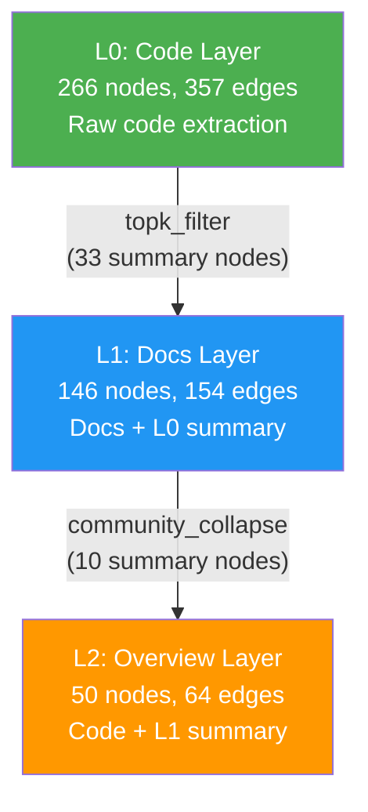

# Hierarchical Knowledge Aggregation for Graphify

> **Issue Origin:** Single flat knowledge graph cannot represent hierarchical project structure. Large-scale codebases need layered knowledge with bottom-up aggregation and intelligent query routing.

---

### 1. Problem Statement: Why Hierarchical Knowledge Aggregation?

Graphify originally supported only a **single flat knowledge graph** — all source files (code, docs, images) are extracted, merged into one `graph.json`, and served via MCP as a flat graph.

This reveals three core problems in large-scale projects:

1. **Information Overload** 🤯: A 500+ file project produces a graph with thousands of nodes. LLM query token budgets are wasted on irrelevant details, and key architectural information is buried.

2. **Lack of Abstraction Levels** 🏗️: Microservice architectures are naturally hierarchical (services → domains → system), but flat graphs cannot represent this. Asking "what is the system architecture?" vs. "how does auth function call work?" requires completely different abstraction levels.

3. **Inefficient Queries** 🐌: Every query searches the entire graph, unable to leverage hierarchical structure to narrow scope.

**Core Insight:** Knowledge should be layered like geographic maps — bottom layers are street-level detail, upper layers are city-level overviews. Upper layer graph = own content + lower layer summary, forming a strict layered DAG.

### 2. Architecture Design

#### 2.1 Overall Architecture

```
┌─────────────────────────────────────────────────────────┐
│                    layers.yaml                           │
│  Define hierarchy, sources, route keywords, aggregation  │
└──────────────────────┬──────────────────────────────────┘
                       │ load_layers()
                       ▼
┌─────────────────────────────────────────────────────────┐
│              Layer Config Foundation                     │
│  LayerConfig · LayerRegistry · DAG validation · topo sort│
└──────────────────────┬──────────────────────────────────┘
                       │ topological order
                       ▼
┌─────────────────────────────────────────────────────────┐
│              Build Pipeline (per layer)                  │
│  extract → build → aggregate(parent) → merge → cluster  │
│                    → save graph.json + report            │
└──────────┬───────────────────────┬──────────────────────┘
           │                       │
     ┌─────▼─────┐          ┌─────▼──────┐
     │ Aggregation│          │   Query    │
     │  Engine    │          │  Routing   │
     │            │          │            │
     │ · none     │          │ · keyword  │
     │ · topk     │          │ · abstract │
     │ · collapse │          │ · auto-zoom│
     │ · llm      │          │ · drill-down│
     │ · composite│          │            │
     └───────────┘          └────────────┘
```

#### 2.2 Layered DAG Model



**Key Constraints:**
- Strict layering: each child references exactly one parent, no cross-layer dependencies
- Topological ordering: parents must be built before children
- Summary node prefix: `summary:<parent_id>:<original_id>` to avoid naming collisions
- Provenance tracking: every summary node carries a `_source_layer` attribute

#### 2.3 Aggregation Strategies

| Strategy | Description | Use Case |
|----------|-------------|----------|
| `none` | Returns empty graph (no-op) | Root layers, no aggregation needed |
| `topk_filter` | Select top-K nodes by degree, filter file-level hubs | Medium scale, preserve key nodes |
| `community_collapse` | Community detection → collapse into abstract concept nodes | Large scale, structural compression |
| `llm_summary` | LLM semantic summarization, JSON format output | High-quality semantic compression |
| `composite` | community_collapse → llm_summary pipeline | Maximum compression ratio |

#### 2.4 Query Routing

```
User Question
    │
    ▼
┌──────────────┐
│ Keyword Score │ ← route_keywords + abstract/concrete term sets
│ + Level Weight│ ← abstract terms → higher layers, concrete → lower
└──────┬───────┘
       │
       ▼
┌──────────────┐     Sparse results?
│ Route to Best │ ──────────────→ Auto-Zoom: drill down to child layer
│    Layer      │
└──────┬───────┘
       │
       ▼
   Return Result
```

### 3. Implementation Details

#### 3.1 New Modules

| File | Responsibility | Lines |
|------|---------------|-------|
| `graphify/layer_config.py` | Layer config parsing, DAG validation, topological sort, LayerRegistry | ~200 |
| `graphify/aggregate.py` | 5 aggregation strategies + LLM integration + fallback | ~280 |
| `graphify/layer_pipeline.py` | Layered build orchestration, parallel build, provenance | ~260 |
| `graphify/query_router.py` | Query routing, auto-zoom, drill-down | ~240 |

#### 3.2 Modified Modules

| File | Changes |
|------|---------|
| `graphify/build.py` | +`merge_graphs()` +`graph_diff()` |
| `graphify/serve.py` | +Multi-layer MCP mode +auto-detection +layer_info/drill_down tools |
| `graphify/__main__.py` | +build/layer-info/layer-tree/layer-diff commands +--layers/--layer/--auto-zoom flags |
| `pyproject.toml` | +`layers` extras group (pyyaml) |

#### 3.3 Output Directory Structure

```
graphify-out/
├── layers/
│   ├── L0/
│   │   ├── graph.json          # L0 full graph
│   │   └── GRAPH_REPORT.md     # L0 analysis report
│   ├── L1/
│   │   ├── aggregation/
│   │   │   └── from_L0.json    # Summary subgraph aggregated from L0 (provenance)
│   │   ├── graph.json          # L1 full graph (includes summary:L0: prefixed nodes)
│   │   └── GRAPH_REPORT.md
│   └── L2/
│       ├── aggregation/
│       │   └── from_L1.json    # Summary subgraph aggregated from L1
│       ├── graph.json
│       └── GRAPH_REPORT.md
└── layers.yaml                 # Config file copy (optional)
```

#### 3.4 Parallel Build

Same-depth layers are built in parallel using `concurrent.futures.ProcessPoolExecutor`, with automatic fallback to sequential on failure:

```python
level_groups = _group_by_level(layers_to_build)
for level, level_layers in sorted(level_groups.items()):
    if parallel and len(level_layers) > 1:
        try:
            results = _build_level_parallel(level_layers, parent_graphs, out_root)
        except Exception:
            # fallback: sequential retry with warning
```

### 4. Test Records

#### 4.1 Unit Test Coverage

| Test File | Tests | Coverage |
|-----------|-------|----------|
| `test_layer_config.py` | 21 | Config parsing, DAG validation, cycle detection, topo sort, level computation, Registry |
| `test_merge_graphs.py` | 7 | Graph merge, prefix remapping, attribute preservation, provenance tagging, type preservation |
| `test_aggregate.py` | 26 | 5 strategies, hub exclusion, confidence filtering, LLM mock, fallback |
| `test_layer_pipeline.py` | 8 | 2-layer build, output structure, incremental build, missing parent auto-build |
| `test_cli_layers.py` | 5 | build --layers, --layer, error handling |
| `test_query_router.py` | 16 | Keyword routing, abstract/concrete terms, CJK support, auto-zoom, drill-down |
| `test_cli_polish.py` | 20 | layer-info/tree/diff, provenance, parallel build, auto-detection |
| **Total** | **103** | |

#### 4.2 Real Data Validation

Built a 3-layer architecture using 3 corpora (example, httpx, mixed-corpus) from `worked_team`:

```
$ graphify build --layers layers.yaml
[graphify] Building layer: L0 (Code)
[graphify] Building layer: L1 (Docs)
[graphify] Building layer: L2 (Overview)
[graphify] Layer build complete.
```

**Compression Results:**

| Layer | Nodes | Edges | Compression (vs L0) |
|-------|-------|-------|---------------------|
| L0 (Code) | 266 | 357 | 1.0x |
| L1 (Docs) | 146 | 154 | 1.8x |
| L2 (Overview) | 50 | 64 | **5.3x** |

**Provenance Tracking:**

| File | Summary Nodes | Summary Edges |
|------|--------------|---------------|
| L1/aggregation/from_L0.json | 33 | 1 |
| L2/aggregation/from_L1.json | 10 | 8 |

**Query Routing Validation:**

| Question | Routed To | Auto-Zoom |
|----------|-----------|-----------|
| "How does the Client class handle authentication?" | L2 (Overview) | ✅ L1→L2 |
| "What is the system architecture overview?" | L2 (Overview) | — |
| "How does the parser validate documents?" (--layer L0) | L0 (Code) | — |

### 5. Usage

#### 5.1 Create `layers.yaml`

```yaml
layers:
  - id: L0
    name: Code
    description: Source code modules
    sources:
      - path: ./src/services
    route_keywords: [code, function, class, implementation]
    aggregation:
      strategy: none

  - id: L1
    name: Domain
    description: Domain-level knowledge
    parent: L0
    sources:
      - path: ./src/domains
    route_keywords: [domain, service, module]
    aggregation:
      strategy: topk_filter
      params:
        top_k_nodes: 20
        min_confidence: INFERRED

  - id: L2
    name: System
    description: System architecture overview
    parent: L1
    sources:
      - path: ./docs/architecture
    route_keywords: [architecture, overview, system, design]
    aggregation:
      strategy: community_collapse
      params:
        nodes_per_community: 3
```

#### 5.2 Build Layered Graph

```bash
# Build all layers
graphify build --layers layers.yaml

# Rebuild only one layer (incremental)
graphify build --layers layers.yaml --layer L2
```

#### 5.3 Inspect Layers

```bash
# Table format layer stats
graphify layer-info --layers layers.yaml

# ASCII tree structure
graphify layer-tree --layers layers.yaml

# Compare two layers
graphify layer-diff L0 L1 --layers layers.yaml
```

#### 5.4 Query

```bash
# Auto-route to best layer
graphify query "What is the system architecture?" --layers layers.yaml

# Query specific layer
graphify query "How does auth work?" --layers layers.yaml --layer L0

# Disable auto-zoom
graphify query "system overview" --layers layers.yaml --auto-zoom off
```

#### 5.5 MCP Server

The MCP server auto-detects `graphify-out/layers/` directory — no manual flags needed:

```python
# Auto mode: if graphify-out/layers/ exists and layers.yaml is valid, enable multi-layer
graphify serve

# Manual specification
graphify serve --layers layers.yaml
```

New MCP tools:
- `layer_info` — List all layers with stats
- `drill_down` — Query a specific layer by ID
- `query_graph` — Auto-routed query (multi-layer mode)

---

## Implementation Phases

| Phase | Change | Tasks | Status |
|-------|--------|-------|--------|
| 1 | `layer-config-foundation` | 36 | ✅ Complete |
| 2 | `aggregation-engine` | 32 | ✅ Complete |
| 3 | `query-routing` | 27 | ✅ Complete |
| 4 | `cli-polish` | 22 | ✅ Complete |
| **Total** | | **117** | **✅** |

## Key Design Decisions

| Decision | Choice | Rationale |
|----------|--------|-----------|
| Config format | YAML | Human-readable, supports comments, widely used in DevOps |
| DAG validation | DFS cycle detection + Kahn's topo sort | Deterministic, stable ordering, O(V+E) |
| Summary node naming | `summary:<parent>:<id>` prefix | Avoids ID collisions, traceable to source layer |
| Provenance format | JSON (same as graph.json) | Inspectable, loadable by `build_from_json()` |
| Parallel build | `concurrent.futures.ProcessPoolExecutor` | Standard library, no new deps, NetworkX serializable |
| LLM fallback | topk_filter on failure | Graceful degradation, always produces usable output |
| Auto-detection | Check `graphify-out/layers/` + valid `layers.yaml` | Zero-config for existing users, safe fallback |
