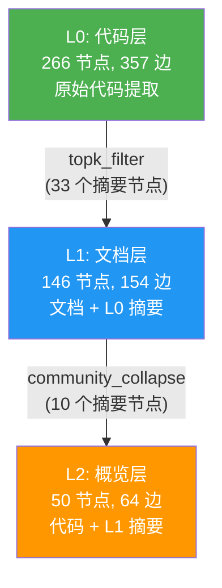

# Graphify 分层知识聚合

> **Issue 起源：** 单一扁平知识图谱无法表达项目的层次结构。大型代码库需要分层知识、自底向上聚合和智能查询路由。

---

### 一、问题背景：为什么需要分层知识聚合？

Graphify 原本只支持**单一扁平知识图谱**——所有源文件（代码、文档、图片）提取后合并成一个 `graph.json`，通过 MCP 以扁平图提供服务。

这在大型项目中暴露了三个核心问题：

1. **信息过载** 🤯：500+ 文件的项目，图谱可能有数千节点。LLM 查询时 token 预算浪费在无关细节上，关键架构信息被淹没。

2. **缺乏抽象层次** 🏗️：微服务架构天然是分层的（服务 → 领域 → 系统），但扁平图谱无法体现这种层次关系。问"系统架构是什么"和问"auth 函数怎么调用"需要完全不同的抽象级别。

3. **查询效率低下** 🐌：每次查询都在全图搜索，无法利用层次结构缩小搜索范围。

**核心思想：** 知识应该像地理地图一样分层——底层是街道级细节，上层是城市级概览。上层图 = 自身内容 + 下层摘要，形成严格的分层 DAG。

### 二、架构设计

#### 2.1 整体架构

```
┌─────────────────────────────────────────────────────────┐
│                    layers.yaml                           │
│  定义层次结构、数据源、路由关键词、聚合策略              │
└──────────────────────┬──────────────────────────────────┘
                       │ load_layers()
                       ▼
┌─────────────────────────────────────────────────────────┐
│              Layer Config Foundation                     │
│  LayerConfig · LayerRegistry · DAG 验证 · 拓扑排序      │
└──────────────────────┬──────────────────────────────────┘
                       │ topological order
                       ▼
┌─────────────────────────────────────────────────────────┐
│              Build Pipeline (per layer)                  │
│  extract → build → aggregate(parent) → merge → cluster  │
│                    → save graph.json + report            │
└──────────┬───────────────────────┬──────────────────────┘
           │                       │
     ┌─────▼─────┐          ┌─────▼──────┐
     │ Aggregation│          │   Query    │
     │  Engine    │          │  Routing   │
     │            │          │            │
     │ · none     │          │ · keyword  │
     │ · topk     │          │ · abstract │
     │ · collapse │          │ · auto-zoom│
     │ · llm      │          │ · drill-down│
     │ · composite│          │            │
     └───────────┘          └────────────┘
```

#### 2.2 分层 DAG 模型



**关键约束：**
- 严格分层：子层只能引用一个父层，无跨层依赖
- 拓扑排序：父层必须先于子层构建
- 摘要节点前缀：`summary:<parent_id>:<original_id>` 避免命名冲突
- 溯源标记：每个摘要节点携带 `_source_layer` 属性

#### 2.3 聚合策略

| 策略 | 描述 | 适用场景 |
|------|------|----------|
| `none` | 返回空图（无操作） | 根层，不需要聚合 |
| `topk_filter` | 按度数选 Top-K 节点，过滤文件级 hub | 中等规模，保留关键节点 |
| `community_collapse` | 社区检测后折叠为抽象概念节点 | 大规模，需要结构性压缩 |
| `llm_summary` | LLM 语义摘要，JSON 格式输出 | 需要高质量语义压缩 |
| `composite` | community_collapse → llm_summary 管道 | 最高压缩比 |

#### 2.4 查询路由

```
用户问题
    │
    ▼
┌──────────────┐
│ 关键词评分    │ ← route_keywords + abstract/concrete 术语集
│ + 层级加权    │ ← 抽象词偏向高层，具体词偏向低层
└──────┬───────┘
       │
       ▼
┌──────────────┐     结果稀疏？
│ 路由到最佳层  │ ──────────────→ Auto-Zoom: 自动下钻到子层
└──────┬───────┘
       │
       ▼
   返回结果
```

### 三、实现细节

#### 3.1 新增模块

| 文件 | 职责 | 代码行数 |
|------|------|----------|
| `graphify/layer_config.py` | 层配置解析、DAG 验证、拓扑排序、LayerRegistry | ~200 |
| `graphify/aggregate.py` | 5 种聚合策略 + LLM 集成 + fallback | ~280 |
| `graphify/layer_pipeline.py` | 分层构建编排、并行构建、provenance | ~260 |
| `graphify/query_router.py` | 查询路由、auto-zoom、drill-down | ~240 |

#### 3.2 修改模块

| 文件 | 变更 |
|------|------|
| `graphify/build.py` | +`merge_graphs()` +`graph_diff()` |
| `graphify/serve.py` | +多图层 MCP 模式 +auto-detection +layer_info/drill_down 工具 |
| `graphify/__main__.py` | +build/layer-info/layer-tree/layer-diff 命令 +--layers/--layer/--auto-zoom 参数 |
| `pyproject.toml` | +`layers` extras group (pyyaml) |

#### 3.3 输出目录结构

```
graphify-out/
├── layers/
│   ├── L0/
│   │   ├── graph.json          # L0 完整图谱
│   │   └── GRAPH_REPORT.md     # L0 分析报告
│   ├── L1/
│   │   ├── aggregation/
│   │   │   └── from_L0.json    # 从 L0 聚合的摘要子图（provenance）
│   │   ├── graph.json          # L1 完整图谱（含 summary:L0: 前缀节点）
│   │   └── GRAPH_REPORT.md
│   └── L2/
│       ├── aggregation/
│       │   └── from_L1.json    # 从 L1 聚合的摘要子图
│       ├── graph.json
│       └── GRAPH_REPORT.md
└── layers.yaml                 # 配置文件副本（可选）
```

#### 3.4 并行构建

同深度层使用 `concurrent.futures.ProcessPoolExecutor` 并行构建，失败时自动降级为顺序构建：

```python
level_groups = _group_by_level(layers_to_build)
for level, level_layers in sorted(level_groups.items()):
    if parallel and len(level_layers) > 1:
        try:
            results = _build_level_parallel(level_layers, parent_graphs, out_root)
        except Exception:
            # fallback: 顺序重试并打印警告
```

### 四、测试记录

#### 4.1 单元测试覆盖

| 测试文件 | 测试数 | 覆盖范围 |
|----------|--------|----------|
| `test_layer_config.py` | 21 | 配置解析、DAG 验证、循环检测、拓扑排序、层级计算、Registry |
| `test_merge_graphs.py` | 7 | 图合并、前缀重映射、属性保留、溯源标记、类型保留 |
| `test_aggregate.py` | 26 | 5 种策略、hub 排除、置信度过滤、LLM mock、fallback |
| `test_layer_pipeline.py` | 8 | 2 层构建、输出结构、增量构建、缺失父层自动构建 |
| `test_cli_layers.py` | 5 | build --layers、--layer、错误处理 |
| `test_query_router.py` | 16 | 关键词路由、抽象/具体词、中文支持、auto-zoom、drill-down |
| `test_cli_polish.py` | 20 | layer-info/tree/diff、provenance、并行构建、auto-detection |
| **总计** | **103** | |

#### 4.2 真实数据验证

使用 `worked_team` 中的 3 个语料库（example、httpx、mixed-corpus）构建 3 层架构：

```
$ graphify build --layers layers.yaml
[graphify] Building layer: L0 (Code)
[graphify] Building layer: L1 (Docs)
[graphify] Building layer: L2 (Overview)
[graphify] Layer build complete.
```

**压缩效果：**

| 层 | 节点数 | 边数 | 压缩比（vs L0） |
|----|--------|------|-----------------|
| L0 (Code) | 266 | 357 | 1.0x |
| L1 (Docs) | 146 | 154 | 1.8x |
| L2 (Overview) | 50 | 64 | **5.3x** |

**Provenance 溯源：**

| 文件 | 摘要节点数 | 摘要边数 |
|------|-----------|---------|
| L1/aggregation/from_L0.json | 33 | 1 |
| L2/aggregation/from_L1.json | 10 | 8 |

**查询路由验证：**

| 问题 | 路由到 | Auto-Zoom |
|------|--------|-----------|
| "How does the Client class handle authentication?" | L2 (Overview) | ✅ L1→L2 |
| "What is the system architecture overview?" | L2 (Overview) | — |
| "How does the parser validate documents?" (--layer L0) | L0 (Code) | — |

### 五、使用方式

#### 5.1 创建 `layers.yaml`

```yaml
layers:
  - id: L0
    name: Code
    description: Source code modules
    sources:
      - path: ./src/services
    route_keywords: [code, function, class, implementation]
    aggregation:
      strategy: none

  - id: L1
    name: Domain
    description: Domain-level knowledge
    parent: L0
    sources:
      - path: ./src/domains
    route_keywords: [domain, service, module]
    aggregation:
      strategy: topk_filter
      params:
        top_k_nodes: 20
        min_confidence: INFERRED

  - id: L2
    name: System
    description: System architecture overview
    parent: L1
    sources:
      - path: ./docs/architecture
    route_keywords: [architecture, overview, system, design]
    aggregation:
      strategy: community_collapse
      params:
        nodes_per_community: 3
```

#### 5.2 构建分层图谱

```bash
# 构建所有层
graphify build --layers layers.yaml

# 只重建某一层（增量构建）
graphify build --layers layers.yaml --layer L2
```

#### 5.3 查看层信息

```bash
# 表格形式查看层状态
graphify layer-info --layers layers.yaml

# ASCII 树形结构
graphify layer-tree --layers layers.yaml

# 对比两层差异
graphify layer-diff L0 L1 --layers layers.yaml
```

#### 5.4 查询

```bash
# 自动路由到最佳层
graphify query "What is the system architecture?" --layers layers.yaml

# 查询指定层
graphify query "How does auth work?" --layers layers.yaml --layer L0

# 关闭 auto-zoom
graphify query "system overview" --layers layers.yaml --auto-zoom off
```

#### 5.5 MCP 服务器

MCP 服务器自动检测 `graphify-out/layers/` 目录，无需手动指定：

```bash
# 自动模式：如果 graphify-out/layers/ 存在且 layers.yaml 有效，启用多图层
graphify serve

# 手动指定
graphify serve --layers layers.yaml
```

新增 MCP 工具：
- `layer_info` — 列出所有层及统计信息
- `drill_down` — 查询指定层
- `query_graph` — 自动路由查询（多图层模式）

---

## 实施阶段

| 阶段 | 变更 | 任务数 | 状态 |
|------|------|--------|------|
| 1 | `layer-config-foundation` | 36 | ✅ 已完成 |
| 2 | `aggregation-engine` | 32 | ✅ 已完成 |
| 3 | `query-routing` | 27 | ✅ 已完成 |
| 4 | `cli-polish` | 22 | ✅ 已完成 |
| **总计** | | **117** | **✅** |

## 关键设计决策

| 决策 | 选择 | 理由 |
|------|------|------|
| 配置格式 | YAML | 人类可读，支持注释，DevOps 广泛使用 |
| DAG 验证 | DFS 循环检测 + Kahn 拓扑排序 | 确定性、稳定排序、O(V+E) |
| 摘要节点命名 | `summary:<parent>:<id>` 前缀 | 避免 ID 冲突，可追溯到源层 |
| 溯源格式 | JSON（与 graph.json 相同） | 可检查、可通过 `build_from_json()` 加载 |
| 并行构建 | `concurrent.futures.ProcessPoolExecutor` | 标准库、无新依赖、NetworkX 可序列化 |
| LLM 降级 | 失败时回退到 topk_filter | 优雅降级，始终产生可用输出 |
| 自动检测 | 检查 `graphify-out/layers/` + 有效 `layers.yaml` | 对现有用户零配置，安全回退 |
