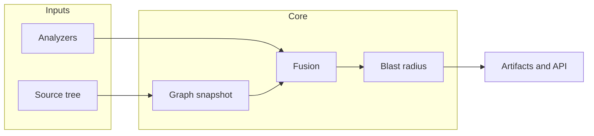

# depOS — architecture

## Graph construction (graphify)

depOS keeps graphify’s **graph building logic** for code snapshots: **`graphify.extract.extract`** → **`graphify.build.build_from_json`** (typically `directed=True` for dependency direction). That path performs NetworkX assembly, ID normalization, and edge reconciliation—**do not replace** with a parallel JSON→graph implementation for the main pipeline. Diagnostics attach **after** the graph is built (node/edge attributes), unless a future change extends graphify’s extraction schema in a validated way.

## Goals

- **Graph-first, change-aware** — Every analysis starts from a dependency graph per commit; deltas drive blast-radius.
- **Diagnostics-fused** — External analyzers (SARIF, linters, typecheckers, tests) **attach** to nodes and optionally mark edges as faulty; graphify does not invent diagnostics.
- **CI-native** — Reusable workflows produce Check Runs and versioned artifacts (`graph_with_diagnostics.json`).
- **Org policy** — Blast radius across repositories only includes **allowlisted** repos; RBAC controls who can enable repos.

## Logical components

| Component | Role |
| --------- | ---- |
| **Snapshot worker** | Clone + run vendored `graphify` extract/build; persist node-link graph per `(repo, commit)`. |
| **Diagnostics fusion** | Ingest SARIF / tool JSON; map `file:line` to graph nodes; build `error_index` and edge fault hints. |
| **Federation** | Resolve cross-repo edges (e.g. internal packages, manifests) within allowlist. |
| **Blast engine** | Seed from git diff; k-hop expansion on directed graph; defect-aware ranking; cross-branch comparisons. |
| **API** | Auth, org/repo settings, CI callback, LLM/MCP graph export. |
| **Web app** | Dashboards, graph explorer with error overlays, allowlist admin, CI history. |

## Data flow (simplified)

## Graph contract for LLMs

- Nodes may include `errors[]` with category, severity, rule id, message, and tool provenance.
- Edges may include `fault` / category when a diagnostic implicates a specific relationship.
- Responses should include a compact **error index** and optional narrative summary for agents.

## Storage

- Graph blobs (JSON) per commit; metadata and federation in a relational store; SARIF and raw logs as object storage or blob columns.

See [graphify-internals.md](graphify-internals.md) for the extraction pipeline inside the vendored library.
